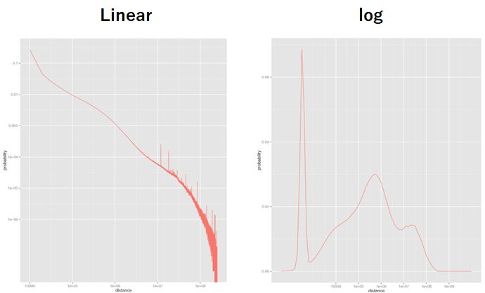

Commands for Hi-C and Micro-C processing
================================================

**CustardPy** internally executes `Juicer <https://github.com/aidenlab/juicer/wiki>`_ and `juicertools <https://github.com/aidenlab/juicer/wiki/Feature-Annotation>`_.
See the original website for the full description of each command.

.. contents:: 
   :depth: 3

Hi-C analysis
------------------------------------------------

custardpy_juicer
++++++++++++++++++++++++++

``custardpy_juicer`` is an end-to-end pipeline for Juicer analysis.
It executes ``juicer_map.sh``, ``juicer_pigz.sh``, ``plot_distance_count.sh``, 
``juicer_callTAD.sh``, ``call_HiCCUPS.sh``, ``makeMatrix_intra.sh``,  ``makeEigen.sh``, and  ``makeInslationScore.sh``.
The results are stored in ``CustardPyResults_Hi-C/Juicer_$build/$prefix/``.

.. code-block:: bash

  custardpy_juicer [Options] <fastqdir> <label>
    <fastqdir>: directory that contains input fastq files (e.g., "fastq/sample1")
    <label>: label of the input (e.g., "sample1")
    Options:
        -i index : bwa index
        -g genometable : genome table file (describing the chromosome length)
        -e enzyme : enzyme (HindIII|MboI|DpnII|Sau3AI|Arima, default: HindIII)
        -b build : genome build (hg19|hg38|mm10|mm39|rn7|galGal5|galGal6|ce10|ce11|danRer11|dm6|xenLae2|sacCer3)
        -z [_|_R]: if the filename of fastqs is *_[1|2].fastq, supply "_". if *_[R1|R2].fastq, choose "_R". (default: "_")
        -o outputdir : output directory (default: 'CustardPyResults_Hi-C')
        -n [NONE|VC|VC_SQRT|KR|SCALE] : normalization type (default: SCALE)
        -a <refFlat>: gene annotation file
        -r resolutions : resolutions for 1D metrics calculation (default: "25000 50000 100000", should be quoted and separated by spaces)
        -p ncore: number of CPUs (default: 32)
        -m tmpdir: tempdir
        -L: Allocate larger memory ("-Xms1024m -Xmx655360m", default: "-Xms512m -Xmx65536m", for deep-sequenced samples; e.g., Rao 2014)
    Example:
        custardpy_juicer -i bwaindex/hg38 -g genometable.hg38.txt -b hg38 -e HindIII -z _R -a refFlat.hg38.txt fastq/Hap1-A Hap1-A

juicer_map.sh
+++++++++++++++++++++++++++++++++++

``juicer_map.sh`` map FASTQ files using BWA and generates ``.hic`` file using `juicertools <https://github.com/aidenlab/juicer/wiki/Feature-Annotation>`_.
The input FASTQ files can be gzipped (.fastq.gz).
The results including the ``.hic`` file is outputted in ``$odir``.
The BWA index of the reference genome is necessary.

.. code-block:: bash

    juicer_map.sh [options] <fastqdir> <odir> <build> <gt> <bwaindex> <enzyme> <fastq_post>
      <fastqdir>: directory that contains input fastq files (e.g., "fastq/sample1")
      <odir>: output directory (e.g., "JuicerResults/sample1")
      <build>: genome build (e.g., hg38)
      <gt>: genome table
      <bwaindex>: index file of BWA
      <enzyme>: enzyme (e.g., HindIII, MboI)
      <fastq_post [_|_R]>: if the filename of fastqs is *_[1|2].fastq, supply "_". if *_[R1|R2].fastq, choose "_R".

    Options:
        -p ncore: number of CPUs (default: 32)
        -m tmpdir: tempdir
        -L: Allocate larger memory ("-Xms1024m -Xmx655360m", default: "-Xms512m -Xmx65536m", for deep-sequenced samples; e.g., Rao 2014)
    Example:
      juicer_map.sh $(pwd)/fastq/Hap1-A/ $(pwd)/JuicerResults/Hap1-A hg38 genometable.hg38.txt bwaindex/hg38 HindIII _R

.. note::

    The input FASTQ files of each sample should be stored in the separated directory.
    For example, if there are three Hi-C samples (``sample1``, ``sample2``, and ``sample3``), the fastq files should be in ``fastq/sample1/``,  ``fastq/sample2/``, and ``fastq/sample3/``.

- Output

    - merged_nodups.txt ... mapped fragments
    - inter.hic ... .hic file (without quality filtering)
    - inter.txt ... stats for inter.hic
    - inter_30.hic ... .hic file (Q>=30)
    - inter_30.txt ... stats for inter_30.hic

We recommend using ``inter_30.hic`` for the downstream analysis.

juicer_pigz.sh
+++++++++++++++++++++++++++++++++++

Since the output files of Juicer are quite large, **CustardPy** provide a script ``juicer_pigz.sh`` that compresses the intermediate files.
This command is optional while ``custardpy_juicer`` implements it.

.. code-block:: bash

     juicer_pigz.sh <odir>
       <odir> output directory of juicer_map.sh (e.g., "JuicerResults/sample1")

Note that some commands provided in Juicer use the intermediate files (e.g, ``mega.sh``).
Because these commands do not accept the compressed format, use ``juicer_unpigz.sh`` that uncompresses the compressed files.

.. code-block:: bash

     juicer_unpigz.sh <odir>
       <odir> output directory of juicer_map.sh (e.g., "JuicerResults/sample1")

plot_distance_count.sh
+++++++++++++++++++++++++++++++++++

``plot_distance_count.sh`` calcultes the fragment distance and generates a figure (.pdf).
The result is outputted in ``distance/`` directory.

.. code-block:: bash

     plot_distance_count.sh <label> <odir>
       <label>: title of the figure
       <odir> output directory of juicer_map.sh (e.g., "JuicerResults/sample1")

- Output

    - distance_vs_count.10kb.MAPQ30.pdf ... figure of distance plot
    - distance_vs_count.10kb.MAPQ30.txt ... values for the plot
    - distance_vs_count.10kb.MAPQ30.log.pdf ... figure of distance plot (log scale)
    - distance_vs_count.10kb.MAPQ30.log.txt ... values for the plot (log scale)

custardpy_cooler_HiC
+++++++++++++++++++++++++++++++++++

``custardpy_cooler_HiC`` uses Cooler to generates ``.cool`` and ``.hic`` files from FASTQ files.
The input FASTQ files can be gzipped (.fastq.gz).

BWA and chromap can be used for mapping reads (use ``-t`` option).
The results are stored in ``CustardPyResults_Hi-C/Cooler_$build/$prefix/``.

The index file of BWA or chromap (``-i <index>``) and the fasta file of the reference genome (``-f <genome>``) are required.

.. code-block:: bash

  custardpy_cooler_HiC [options] -i <index> -g <gt> -f <genome> <fastqdir> <odir>
    fastqdir: Directory that contains input fastq files (e.g., "fastq/")
    odir: Name of output directory

    Options:
      -S stage : steps to be executed [all|pairs|postproc] (default: all)
        all: execute all process (default)
        map: map reads and exit
        pairs: generate .pair file from map file
        postproc: generate .cool and .hic from .pair file
      -i index : bwa index
      -g genometable : genome table file (describing the chromosome length)
      -f genome file : fasta file of the reference genome (original data of the index files)
      -e enzyme : enzyme (HindIII|MboI|DpnII|Sau3AI, default: HindIII)
      -b build : genome build (hg19|hg38|mm10|mm39|rn7|galGal6|ce11|danRer11|dm6|xenLae2|sacCer3|S.pombe|HVAEP)
      -o outputdir : output directory (default: 'CustardPyResults_Hi-C')
      -q qvalue : threshould of mapped fragments (default: 30, for '--min-mapq' of pairtools parse)
      -p ncore : number of CPUs (default: 4)
      -x postfix
        1: '*_1.fastq.gz' and '*_2.fastq.gz' (default)
        2: '*_R1.fastq.gz' and '*_R2.fastq.gz'
      -m max_distance : 8.4 for human, 8.2 for mouse (for pairsqc.py, default: 8.4)
      -n binsize_min : binsize_min (for cooler cload pairix, default: 5000)
      -r binsize_multi : binsize_multi (for multirescool, default: '5000,10000,25000,50000,100000,500000,1000000,2500000,5000000,10000000')

- Output

    - cool/ ... directory for .cool files
    - hic/ ... directory for the .hic file 
    - log/ ... log files of mapping
    - mapfile/ ... directory of mapping file
    - pairs/ ... .pairs file generated by pairtools
    - qc_report/ ... directory for statistics and QC files

Micro-C analysis
------------------------------------------------

custardpy_cooler_MicroC
+++++++++++++++++++++++++++++++++++

``custardpy_cooler_MicroC`` generates ``.cool`` and ``.hic`` files from FASTQ files using cooltools and JuicerTools.
The input FASTQ files can be gzipped (.fastq.gz).

BWA and chromap can be used for mapping reads (use ``-t`` option).
The results are stored in ``CustardPyResults_MicroC/Cooler_<bwa|chromap>/$prefix``.

The index file of BWA or chromap (``-i <index>``) and the fasta file of the reference genome (``-f <genome>``) are required.

.. code-block:: bash

  custardpy_cooler_MicroC [options] -i <index> -g <gt> -f <genome> <fastqdir> <odir>
    fastqdir: Directory that contains input fastq files (e.g., "fastq/")
    odir: Name of output directory

    Options:
      -S stage : steps to be executed [all|pairs|postproc] (default: all)
        all: execute all process (default)
        map: map reads and exit
        pairs: generate .pair file from map file
        postproc: generate .cool and .hic from .pair file
      -t [bwa|chromap] : tool for mapping (default: bwa)
      -i index : index of bwa or chromap
      -f genome file : fasta file of the reference genome (original data of the index files)
      -g genometable : genome table file (describing the chromosome length)
      -o outputdir : output directory (default: 'CustardPyResults_MicroC')
      -q qvalue : threshould of mapped fragments (default: 30, for '--min-mapq' of pairtools parse)
      -p ncore : number of CPUs (default: 4)
      -x postfix
        1: '*_1.fastq.gz' and '*_2.fastq.gz' (default)
        2: '*_R1.fastq.gz' and '*_R2.fastq.gz'
      -m max_distance : 8.4 for human, 8.2 for mouse (for pairsqc.py, default: 8.4)
      -n binsize_min : binsize_min (for cooler cload pairix, default: 5000)
      -r binsize_multi : binsize_multi (for multirescool, default: '5000,10000,25000,50000,100000,500000,1000000,2500000,5000000,10000000')

- Output

    - cool/ ... directory for .cool files
    - hic/ ... directory for the .hic file 
    - log/ ... log files of mapping
    - mapfile/ ... directory of mapping file
    - pairs/ ... .pairs file generated by pairtools
    - qc_report/ ... directory for statistics and QC files

Common commands for Hi-C and Micro-C
------------------------------------------------

custardpy_process_hic
+++++++++++++++++++++++++++++++++++

``custardpy_process_hic`` takes a ``.hic`` file as input and executes ``juicer_callTAD.sh``, ``call_HiCCUPS.sh``, ``makeMatrix_intra.sh``,  ``makeEigen.sh``, and  ``makeInslationScore.sh``.

.. code-block:: bash

  custardpy_process_hic [Options] <hicfile> <odir>
    <hicfile>: .hic file genreated by Juicer
    <odir> : output directory
    Options:
        -g genometable : genome table file (describing the chromosome length)
        -n [NONE|VC|VC_SQRT|KR|SCALE] : normalization type (default: SCALE)
        -a <refFlat>: gene annotation file
        -r resolutions : resolutions for 1D metrics calculation (default: "25000 50000 100000", should be quoted and separated by spaces)
        -p ncore: number of CPUs (default: 32)
        -o: Use older version of juicer_tools.jar for old .hic files (juicer_tools.1.9.9_jcuda.0.8.jar, default: juicer_tools.1.22.01.jar)
    Example:
        custardpy_process_hic -g genometable.hg38.txt -a refFlat.hg38.txt Hap1-A/inter_30.hic Hap1-A

.. note::

    `custardpy_process_hic` fails when .hic files created by the old version of juice_tools.jar are applied because they do not contain the string "chr" in the chromosome name. In such a case, supply `-o` option in `custardpy_process_hic`, which uses the old version of juicer_tools.jar (juicer_tools.1.9.9_jcuda.0.8.jar).

makeMatrix_intra.sh
+++++++++++++++++++++++++++++++++++

``makeMatrix_intra.sh`` takes a ``.hic`` file as input and generates the matrices of intra-chromosomal interactions for all chromsomes. The chormosome Y and M are omited.

.. code-block:: bash

     makeMatrix_intra.sh <norm> <odir> <hic> <resolution> <gt>
       <norm>: normalization type (NONE|VC|VC_SQRT|KR|SCALE)
       <odir>: output directory (e.g., "JuicerResults/sample1")
       <hic>: .hic file
       <resolution>: resolution of the matrix
       <gt>: genome table
       Options:
         -l: output contact matrix as a list (default: dense matrix)
         -o: Use older version of juicer_tools.jar for old .hic files (juicer_tools.1.9.9_jcuda.0.8.jar, default: juicer_tools.1.22.01.jar)

The resulting observed/oe matrices are output in ``<odir>/Matrix/intrachromosomal/<resolution>/``.

makeMatrix_inter.sh
+++++++++++++++++++++++++++++++++++

``makeMatrix_inter.sh`` generates the inter-chromosomal interactions matrix for a specified chromsome pair.

.. code-block:: bash

    makeMatrix_inter.sh [-l] <norm> <odir> <hic> <resolution> <chr1> <chr2>
       <norm>: normalization type (NONE|VC|VC_SQRT|KR|SCALE)
       <odir>: output directory (e.g., "JuicerResults/sample1")
       <hic>: .hic file
       <resolution>: resolution of the matrix
       <chr1, chr2>: two input chromosomes
       Options:
         -l: output contact matrix as a list (default: dense matrix)
         -o: Use older version of juicer_tools.jar for old .hic files (juicer_tools.1.9.9_jcuda.0.8.jar, default: juicer_tools.1.22.01.jar)

The resulting observed/oe matrices are output in ``<odir>/Matrix/interchromosomal/<resolution>/<chr1>-<chr2>``.

makeEigen.sh
+++++++++++++++++++++++++++++++++++

``makeEigen.sh`` generates eigenvector file (compartment PC1) from a ``.hic`` file using `HiC1Dmetrics <https://h1d.readthedocs.io/en/latest/>`_.
The sign (+-) of the value indicating A/B compartments is adjusted by the number of genes.

.. code-block:: bash

    makeEigen.sh [options] <norm> <odir> <hic> <resolution> <genometable> <refFlat>
      <norm>: normalization type (NONE|VC|VC_SQRT|KR|SCALE)
      <odir>: output directory (e.g., "JuicerResults/sample1")
      <hic>: .hic file
      <resolution>: resolution of matrix
      <genometable>: genometable file
      <refFlat>: gene annotation file (refFlat format)
      Options:
        -p <int>: the number of CPUs (default: 6)

juicer_callTAD.sh
+++++++++++++++++++++++++++++++++++

``juicer_callTAD.sh`` calls TADs from a ``.hic`` file using Juicer ArrowHead.

.. code-block:: bash

    juicer_callTAD.sh [options] <norm> <odir> <hic> <gt>
       <norm>: normalization type (NONE|VC|VC_SQRT|KR|SCALE)
       <odir>: output directory (e.g., "JuicerResults/sample1")
       <hic>: .hic file
       <gt>: genome table
       Options:
         -r resolutions: the resolutions for ArrowHead (default: "10000 25000 50000", should be quoted and separated by spaces)
         -p ncore: number of CPUs (default: 24)
         -o: Use older version of juicer_tools.jar for old .hic files (juicer_tools.1.9.9_jcuda.0.8.jar, default: juicer_tools.1.22.01.jar)

- Output:
    - ``\*_blocks.bedpe`` ... TAD regions (BEDPE format, default output of Juicer ArrowHead)
    - ``\*_blocks.bed`` ... TAD regions (BED format file converted from ``\*_blocks.bedpe``)
    - ``\*_blocks.merged.bed`` ... Non-overlapped TAD list (overlapped TAD are merged by ``bedtools merge``)
    - ``\*_blocks.boundaries.bed`` ... TAD boundaries ("inside" window of called TADs, including boundaries of nested TADs)
    - ``\*_blocks.TADcoverage.bed`` ... Number of TADs that cover the genomic positions (for nested TAD analysis)
    - ``\*_blocks.TADregions.bed`` ... List of intra-TAD regions (inside of TAD boundaries)
    - ``\*_blocks.nonTADregions.bed`` ... List of regions that are not covered by any TADs

.. note::

    Because Juicer ArrowHead allows "nested TADs" and "non-TAD regions", not all genomic regions are included in TADs, and some amount of TAD boundaries may be included in a larger TADs. Make sure that the files you are using meet the criteria of your assumption.

makeInslationScore.sh
+++++++++++++++++++++++++++++++++++

``makeInslationScore.sh`` takes the observed matrices files generated by ``makeMatrix_intra.sh`` as input and calculates the insulation score for all chromsomes. The chormosome Y and M are omited.

The ``<odir>`` directory should be the same with that is specified in ``makeMatrix_intra.sh``.

.. code-block:: bash

  makeInslationScore.sh <norm> <odir> <resolution> <gt>
    <norm>: normalization type (NONE|VC|VC_SQRT|KR|SCALE)
    <odir>: output directory (e.g., "JuicerResults/sample1")
    <resolution>: resolution of the matrix
    <gt>: genome table

The results are output in ``<odir>/InsulationScore/<norm>/<resolution>/``.

call_HiCCUPS.sh (GPU required)
+++++++++++++++++++++++++++++++++++

``call_HiCCUPS.sh`` calls loops using Juicer HiCCUPS.
Supply ``--gpus all`` for Docker and ``--nv`` option for Singularity to activate GPU as follows:

.. code-block:: bash

    singularity exec --nv custardpy_juicer.sif call_HiCCUPS.sh
    docker run --rm -it --gpus all rnakato/custardpy call_HiCCUPS.sh

.. code-block:: bash

    call_HiCCUPS.sh <norm> <odir> <hic>
      <norm>: normalization type (NONE|VC|VC_SQRT|KR|SCALE)
      <odir>: output directory (e.g., "JuicerResults/sample1")
      <hic>: .hic file
      Options:
         -r resolutions: the resolutions (default: "5000,10000,25000", should be quoted and separated by comma)
         -o: Use older version of juicer_tools.jar for old .hic files (juicer_tools.1.9.9_jcuda.0.8.jar, default: juicer_tools.1.22.01.jar)
         
- Output

    - merged_loops.simple.bedpe ... loop file

call_MotifFinder.sh
+++++++++++++++++++++++++++++++++++

If you have peak files of cohesin and CTCF, you can use MotifFinder by ``call_MotifFinder.sh``:

.. code-block:: bash

    call_MotifFinder.sh <build> <motifdir> <loop>
      <build>: genome build
      <motifdir>: the directory that contains the BED files
      <loop>: loop file (.bedpe) obtained by HiCCUPS

If the ``<build>`` is ``(hg19|hg38|mm9|mm10)``, this command automatically supplies `FIMO <http://meme-suite.org/doc/fimo.html>`_ motifs provided by Juicer.

- Output

    - merged_loops_with_motifs.bedpe

See `MotifFinder manual <https://github.com/aidenlab/juicer/wiki/MotifFinder>`_ for more information.

.. note::

    Because an error occurs in the latest version of juicertools, ``CustardPy`` uses juicertools version 1.9.9 for MotifFinder.

calculate_compartment_strength
++++++++++++++++++++++++++++++++++++++++++

``calculate_compartment_strength`` calculates the compartment strength from Hi-C data using `GENOVA <https://github.com/robinweide/GENOVA>`_.

.. code-block:: bash

    calculate_compartment_strength <coolfile> <sample name>
      coolfile: Input Hi-C data (.cool format)
      sample name: Name of the sample (also used for the output file name)

    <Example>
      calculate_compartment_strength Cooler_results/Control/coolfile/Control.25000.cool Control

The output file is ``[sample_name].GENOVA_compartment_score.txt`` containing the compartment strength, which is an average score for the chromosomes.

run_3DChromatin_ReplicateQC.sh
+++++++++++++++++++++++++++++++++++++++++++++++

Since it is written in Python2.7, we use a virtual environment in the CustardPy docker image. 
run_3DChromatin_ReplicateQC.sh`` is a script to run it from the default command line.
Replace ``3DChromatin_ReplicateQC`` with ``run_3DChromatin_ReplicateQC.sh`` in the command line:

.. code-block:: bash

    $ run_3DChromatin_ReplicateQC.sh -h
    usage: 3DChromatin_ReplicateQC [-h]
                                  {run_all,preprocess,qc,concordance,summary,cleanup}
                                  ...

    positional arguments:
      {run_all,preprocess,qc,concordance,summary,cleanup}
        run_all             Run all steps in the reproducibility/QC analysis with
                            this single command
        preprocess          (step 1) split files by chromosome
        qc                  (step 2.a) compute QC per sample
        concordance         (step 2.b) compute reproducibility of replicate pairs
        summary             (step 3) create html report of the results
        cleanup             (step 4) clean up files

    optional arguments:
      -h, --help            show this help message and exit

Utility tools
--------------------------

distance_vs_count.Juicer
+++++++++++++++++++++++++++++++++++

Count the genomic distance of read pairs in the input file (supposing ``align/merged_nodups.txt.gz`` in Juicer outputs)
The output file can be used for the distance plot with ``plot_distance_count.R``.

.. code-block:: bash

    distance_vs_count.Juicer <file> <winsize> <MAPQ>
        <file>:    Input file  (merged_nodups.txt.gz)
        <winsize>: window size (default: 10000)
        <MAPQ>:    MAPQ threshold (default: 30)

    Example:
        distance_vs_count.Juicer align/merged_nodups.txt.gz 50000 30

distance_vs_count.Juicer.log
+++++++++++++++++++++++++++++++++++

Count the genomic distance of read pairs in the input file with the log-scale bins.
The output file can be used for the distance plot with ``plot_distance_count.log.R``.

.. code-block:: bash

    distance_vs_count.Juicer.log                                                                                                     (base) Usage: distance_vs_count.Juicer.log <file> <MAPQ>
        <file>:    Input file  (merged_nodups.txt)
        <MAPQ>:    MAPQ threshold (default: 30)

    Example:
        distance_vs_count.Juicer.log align/merged_nodups.txt.gz 30

convert_JuicerDump_to_dense.py
+++++++++++++++++++++++++++++++++++

Convert interaction frequency file dumped by Juicertools to dense (two-dimensional) matrix.

.. code-block:: bash

    convert_JuicerDump_to_dense.py <inputfile> <outputfile> <genometable> <chr> <resolution> [--help]

    Example:
    convert_JuicerDump_to_dense.py \
        Matrix.observed.VC_SQRT.chrX.txt \
        Matrix.observed.VC_SQRT.chrX.matrix.gz \
        genome_table.txt \
        chrX \
        25000
