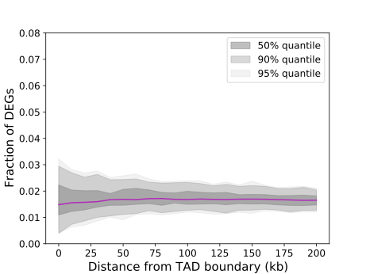

DEG analysis
=====================

DEG_boundary_analysis
---------------------------

``DEG_boundary_analysis`` is designed to carry out TAD-boundary proximity analysis as suggested in `Ghavi-Helm et al., Nat Genet. 2019 <https://www.nature.com/articles/s41588-019-0462-3>`_.
It utilizes a permutation test to estimate the significance of the proximity of differentially expressed genes (DEGs) or differential peaks, to the perturbed TAD boundaries resulting from protein depletion.

.. code-block:: bash

    DEG_boundary_analysis [-h] [--border_test BORDER_TEST]
                          [--border_control BORDER_CONTROL]
                          [--gene_test GENE_TEST]
                          [--gene_control GENE_CONTROL] [-o OUTPUT] [-n N]
                          [--maxdistance MAXDISTANCE] [--step STEP]

    optional arguments:
    -h, --help            show this help message and exit
    --border_test BORDER_TEST
                            <TAD boundary to be tested (BED format)>
    --border_control BORDER_CONTROL
                            <TAD boundary as background (BED format)>
    --gene_test GENE_TEST
                            <Genes to be tested (BED format)>
    --gene_control GENE_CONTROL
                            <Genes as background (BED format)>
    -o OUTPUT, --output OUTPUT
                            Output name (*.pdf or *.png, default: output.pdf)
    -n N                  Number of permutation (default: 1000)
    --maxdistance MAXDISTANCE
                            Max distance (bp, default: 300000)
    --step STEP           Step of distance (bp, default: 10000)

The function requires four BED files as input data:

    - Test TAD boundaries (e.g., boundaries lost due to depletion)
    - Background TAD boundaries (i.e., all boundaries)
    - Test gene loci (e.g., DEGs resulting from depletion)
    - Background gene loci (i.e., all genes)

Using this input, ``DEG_boundary_analysis`` calculates the proportion of genes that overlap with TAD boundaries, extending the distance incrementally (``--step``) up to the defined maximum distance (``--maxdistance``).
The output data is represented graphically:

   DEG_boundary_analysis

The purple line illustrates the observed fraction of tested DEGs against the tested boundaries. If this line deviates from the shaded region, it indicates a significant enrichment or depletion of the DEGs.
