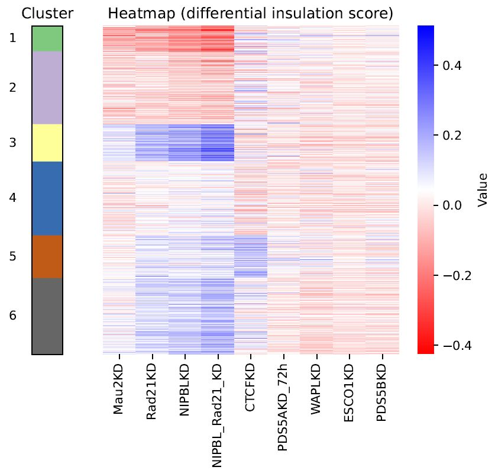
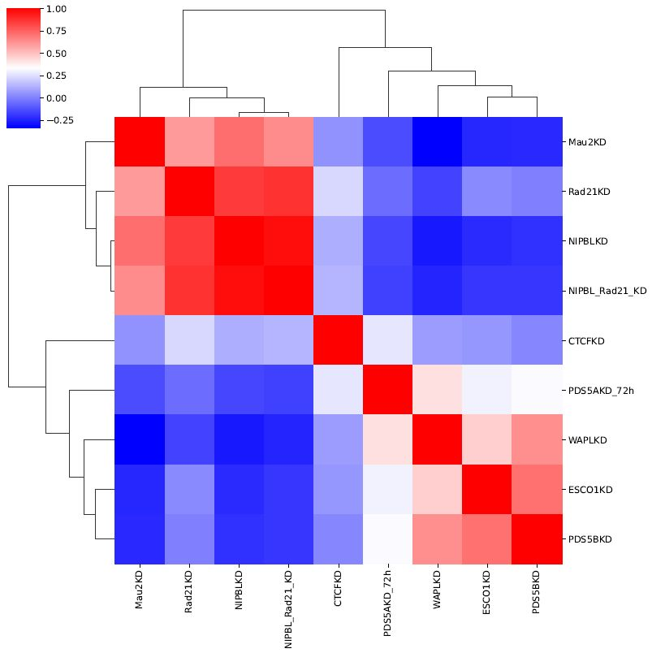
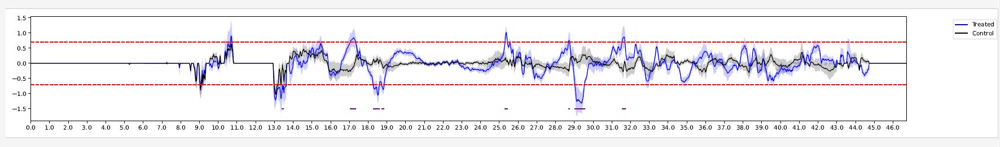

Analysis across multiple samples
=========================================

custardpy_clustering_boundary
-------------------------------------------------

``custardpy_clustering_boundary`` takes the insulation level from multiple Hi-C samples (one control and multiple depletions) and categorizes TAD boundaries according to the similarity in the pattern of insulation level perturbations across the depletion samples. It is noted that the clustering is based on the perturbations in insulation (that is, the difference from the control sample) and not on the insulation level itself.

The function uses the following input data:

    - TAD boundary file (``--boundary``, BED format)
    - A genome_table file (``--gt``)
    - Hi-C sample directory created by ``custardpy_juicer`` command (where the first sample serves as the control)

.. code-block:: bash

    custardpy_clustering_boundary [-h] [--type TYPE] [--boundary BOUNDARY]
                                     [--gt GT] [-r RESOLUTION]
                                     [--ncluster NCLUSTER] [--odir ODIR]
                                     [input [input ...]]

    positional arguments:
        input                 <Input directory>:<label>

    optional arguments:
        --type TYPE           normalize type (default: SCALE)
        --boundary BOUNDARY   Boundary file (BED format)
        --gt GT               Genome table
        -r RESOLUTION, --resolution RESOLUTION  resolution (default: 25000)
        --ncluster NCLUSTER   number of cluster (default: 4)
        --odir ODIR           Output directory (default: output_boundary_clustering)

Example
+++++++++++++++++

You can use `\*boundaries.bed` file located in the ``TAD/`` directory, which is generated by ``juicer_callTAD.sh``.
``custardpy_clustering_boundary`` leverages the 500-kbp distance insulation score (BedGraph format) in ``InsulationScore`` directory generated by ``makeInslationScore.sh``.
Both of these files are automatically created by ``custardpy_juicer``.

.. code-block:: bash

    custardpy_clustering_boundary \
        JuicerResults_hg38/Control:Control \
        JuicerResults_hg38/Rad21KD/:Rad21KD \
        JuicerResults_hg38/NIPBLKD/:NIPBLKD \
        JuicerResults_hg38/CTCFKD//:CTCFKD \
        JuicerResults_hg38/ESCO1KD/:ESCO1KD \
        JuicerResults_hg38/Mau2KD/:Mau2KD \
        JuicerResults_hg38/NIPBL_Rad21_KD/:NIPBL_Rad21_KD \
        JuicerResults_hg38/WAPLKD/:WAPLKD \
        JuicerResults_hg38/PDS5AKD/:PDS5AKD \
        JuicerResults_hg38/PDS5BKD/:PDS5BKD \
        --odir results_clustering_boundary \
        --boundary JuicerResults_hg38/Control/TAD/VC_SQRT/25000_blocks.boundaries.bed \
        --gt genometable.hg38.txt \
        --type VC_SQRT \
        --ncluster 6

The command will generate the following output files in the specified output directory (``--odir``):

    - **Annotated_boundaries.tsv**: The TAD boundaries annotated with state and cluster id.
    - **Heatmap.diff.clustered.pdf**: Heatmap of differential insulation level of all TAD boundaries with clustering, using the hierarchical clustering Ward method.
    - **Insulation_score.chr\*.pdf**: Insulation score plot for each chromosome
    - **Insulation_score.diff.chr\*.pdf**: Differential insulation score (i.e., differences from the control) for each chromosome.



   Heatmap of differential insulation level



   Correlation analysis among samples


custardpy_differential_DRF
-------------------------------------------------

``custardpy_differential_DRF`` is designed to identify "differential DRF regions" by contrasting treated and control Hi-C samples.
"Input samples" includes both treated and negative control samples.
The ``-c`` option is used to specify negative control samples from all input samples. The rest samples are considered as treated samples.

When the ``-c`` option is included, ``custardpy_differential_DRF`` identifies "differential DRF regions" where the DRF score exceeds the set threshold (``--thre``) and the DRF score difference between the treated and control samples surpasses the specified threshold (``--thre``).
In cases where the ``-c`` option is not provided, the command simply detects genomic regions where the DRF score exceeds the set threshold (``--thre``).


.. code-block:: bash

    custardpy_differential_DRF [-h] [-c CONTROL] [--type TYPE] [--gt GT]
                                  [--thre THRE] [-r RESOLUTION]
                                  [--distance_min DISTANCE_MIN]
                                  [--distance_max DISTANCE_MAX] [--odir ODIR]
                                  [input [input ...]]

    positional arguments:
       input                 Input sample '<Input directory>:<label>'

    optional arguments:
        -c CONTROL, --control CONTROL
                                Labels of negative control samples (separated by ',')
        --type TYPE           normalize type (default: SCALE)
        --gt GT               Genome table
        --thre THRE           threshold of differential DRF (default: 0.7)
        -r RESOLUTION, --resolution RESOLUTION
                                resolution (default: 25000)
        --distance_min DISTANCE_MIN
                                minimum distance of DRF (default: 500000)
        --distance_max DISTANCE_MAX
                                maximum distance of DRF (default: 2000000)
        --odir ODIR           Output directory (default: diffDRFregions)


Example
+++++++++++++++++

.. code-block:: bash

    custardpy_differential_DRF --type VC_SQRT --gt genome_table.hg38.txt \
        JuicerResults_20210517/Control_1/:Control_1 \
        JuicerResults_20210517/Control_2/:Control_2 \
        JuicerResults_20210517/Control_3/:Control_3 \
        JuicerResults_20210517/Control_4/:Control_4 \
        JuicerResults_20210517/Control_5/:Control_5 \
        JuicerResults_20210517/Control_6/:Control_6 \
        JuicerResults_20210517/Rad21KD_1/:Rad21KD_1 \
        JuicerResults_20210517/Rad21KD_2/:Rad21KD_2 \
        JuicerResults_20210517/Rad21KD_3/:Rad21KD_3 \
        JuicerResults_20210517/NIPBLKD_1/:NIPBLKD_1 \
        JuicerResults_20210517/NIPBLKD_2/:NIPBLKD_2 \
        JuicerResults_20210517/NIPBLKD_2/:NIPBLKD_3 \
        JuicerResults_20210517/CTCFKD_1/:CTCFKD_1 \
        JuicerResults_20210517/CTCFKD_2/:CTCFKD_2 \
        JuicerResults_20210517/CTCFKD_2/:CTCFKD_3 \
        -c Control_2,Control_3,Control_4,Control_5,Control_6,CTCFKD_1,CTCFKD_2,CTCFKD_3

This command uses ``Control_1`` as the benchmark for calculating the DRF score across all other samples. It's important to note that ``Control_1`` is thus not included when specifying negative control samples with the ```-c`` option (samples separated by ',').

The command generates the following output files in the specified output directory (``--odir``):

    - **DifferentialDRFregions.thre\*.tsv**: The BED file containing the identified differential DRF regions
    - **DRFdiff.chr\*.thre\*.pdf**: Visualization of the differential DRF scores. 



   DifferentialDRFregions (chr21)

The graph presents the average DRF score of treated (blue line) and control (black line) samples. 
The dashed red lines indicates the DRF threshold (both positive and negative values).
The shaded regions indicate the 99% confidence interval. 
The differential DRF regions identified are denoted by the purple lines at the bottom of the visualization.