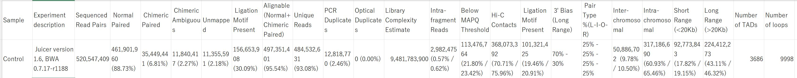
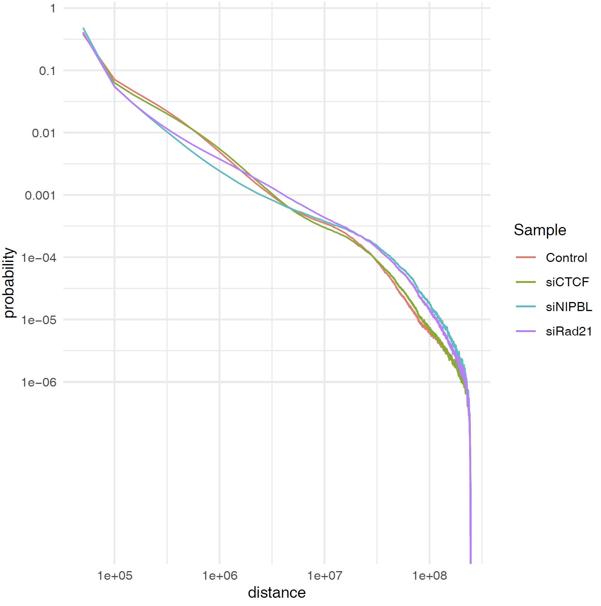
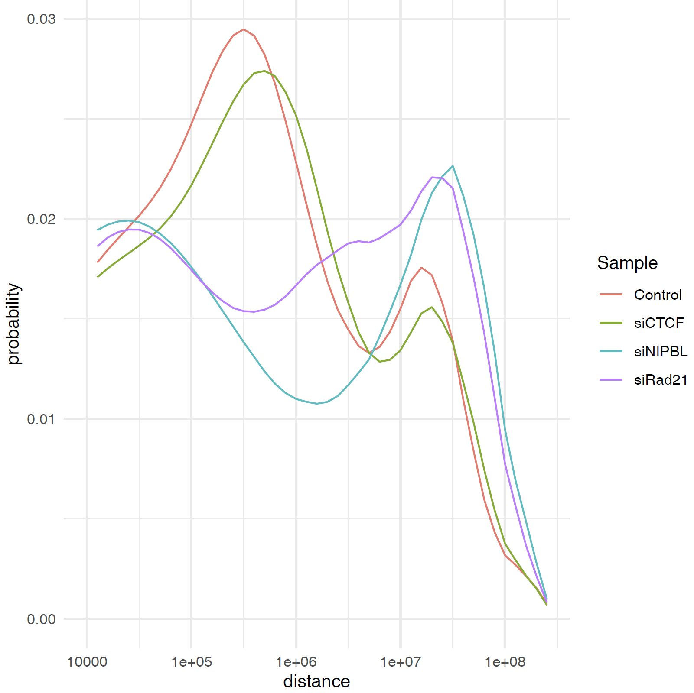

Step-by-Step Workflow of Hi-C Analysis
=============================================

Here we show the step-by-step analysis of Hi-C with CustardPy.
See also the sample scripts in the `tutorial <https://github.com/rnakato/CustardPy/tree/main/tutorial/Hi-C>`_ on GitHub.

.. note::

    As the CustardPy commands below are included in the CustardPy docker image, you need to add docker or singularity commands as shown below.

.. code-block:: bash

    # This example command will mount the /work directory of the host machine
    # For docker
    singularity exec [--nv] --bind /work custardpy.sif <command>
    # For singularity
    docker run --rm -it [--gpus all] -v /work:/work rnakato/custardpy <command>

    # Example of custardpy_juicer
    # For docker
    docker run --rm -it --gpus all -v /work:/work rnakato/custardpy \
        custardpy_juicer -p $ncore -a $gene -b $build -g $gt \
        -i $bwaindex -e $enzyme -z $fastq_post $fqdir $cell

    # For singularity
    singularity exec --nv --bind /work custardpy.sif \
        custardpy_juicer -p $ncore -a $gene -b $build -g $gt \
        -i $bwaindex -e $enzyme -z $fastq_post $fqdir $cell

.. contents:: 
   :depth: 2
   
   
(Optional) download the FASTQ files
----------------------------------------

Here we use the Hi-C samples of human RPE cells from `Nakato et al., Nature Communications, 2023 <https://www.ncbi.nlm.nih.gov/geo/query/acc.cgi?acc=GSE196034>`_ for the example data.

.. code-block:: bash

    mkdir -p fastq/siCTCF fastq/siRad21 fastq/Control

    # siCTCF
    wget -nv --timestamping ftp://ftp.sra.ebi.ac.uk/vol1/fastq/SRR178/013/SRR17870713/SRR17870713_1.fastq.gz -P fastq/siCTCF
    wget -nv --timestamping ftp://ftp.sra.ebi.ac.uk/vol1/fastq/SRR178/013/SRR17870713/SRR17870713_2.fastq.gz -P fastq/siCTCF
    # Control
    wget -nv --timestamping ftp://ftp.sra.ebi.ac.uk/vol1/fastq/SRR178/018/SRR17870718/SRR17870718_1.fastq.gz -P fastq/Control
    wget -nv --timestamping ftp://ftp.sra.ebi.ac.uk/vol1/fastq/SRR178/018/SRR17870718/SRR17870718_2.fastq.gz -P fastq/Control
    # siRad21
    wget -nv --timestamping ftp://ftp.sra.ebi.ac.uk/vol1/fastq/SRR178/040/SRR17870740/SRR17870740_1.fastq.gz -P fastq/siRad21
    wget -nv --timestamping ftp://ftp.sra.ebi.ac.uk/vol1/fastq/SRR178/040/SRR17870740/SRR17870740_2.fastq.gz -P fastq/siRad21

Check the files are properly downloaded.

.. code-block:: bash

    $ ls fastq/*
    fastq/Control:
    SRR17870718_1.fastq.gz  SRR17870718_2.fastq.gz

    fastq/siCTCF:
    SRR17870713_1.fastq.gz  SRR17870713_2.fastq.gz

    fastq/siRad21:
    SRR17870740_1.fastq.gz  SRR17870740_2.fastq.gz

Download the reference genome and build genome index
------------------------------------------------------------

For this tutorial, we provide a script ``gethg38genome.sh`` in CustardPy that downloads the sequence of human genome build hg38.

.. code-block:: bash

    # download genome
    gethg38genome.sh

    # build BWA index
    indexdir=bwa-indexes
    mkdir -p $indexdir
    bwa index -p $indexdir/hg38 genome.hg38.fa
    ln -rsf genome.hg38.fa $indexdir/hg38

Map reads and generate the .hic file 
----------------------------------------------------------

Using the FASTQ files and the BWA index, ``juicer_map.sh`` command generates the .hic file.

.. code-block:: bash

    build=hg38
    gt=genometable.$build.txt
    bwaindex=bwa-indexes/$build
    fastq_post="_"  # "_" or "_R"
    enzyme=MboI
    ncore=32

    cell=Control # (siCTCF siRad21 as well)
    fqdir=fastq/$cell   # FASTQ directory
    odir=CustardPyResults_Hi-C/Juicer_$build/$cell  # Output directory

    juicer_map.sh -p $ncore $fqdir $odir $build $gt $bwaindex $enzyme $fastq_post

.. note::

    If the number of sequenced reads is extremely large (e.g. GM12878 cells from Rao et al. 2014), the generation of the .hic file will fail with an error due to lack of memory. In such a case, supply the ``-L`` option to ``juicer_map.sh``, which allocates a larger amount of memory to juicertools.

(Optional) Compress the intermediate files
----------------------------------------------------------

Since the output files of Juicer are quite large, **CustardPy** provide a script ``juicer_pigz.sh`` that compresses the intermediate files.
This command is optional while ``custardpy_juicer`` implements it.

.. code-block:: bash

    juicer_pigz.sh $odir

Note that some commands provided in Juicer use the intermediate files (e.g, ``mega.sh``).
Because these commands do not accept the compressed format, use ``juicer_unpigz.sh`` that uncompresses the compressed files.

.. code-block:: bash

    juicer_unpigz.sh $odir

Plot the fragment distance
----------------------------------------------------------

``plot_distance_count.sh`` calcultes the fragment distance and generates a figure (.pdf).
The result is outputted in ``distance/`` directory.

.. code-block:: bash

    plot_distance_count.sh $cell $odir

- Output

    - distance_vs_count.MAPQ30.pdf ... Figure of distance plot
    - distance_vs_count.MAPQ30.txt ... Values for the plot
    - distance_vs_count.MAPQ30.log.pdf ... Figure of distance plot (log scale bins)
    - distance_vs_count.MAPQ30.log.txt ... Values for the plot (log scale bins)

.. image:: img/distanceplot.jpg
   :width: 600px
   :align: center
   :alt: Alternate

Make a contact matrix
----------------------------------------------------------

``makeMatrix_intra.sh`` takes a ``.hic`` file as input and generates the matrices of intra-chromosomal interactions for all chromsomes. The chormosome Y and M are omited.

.. code-block:: bash

    build=hg38
    gt=genometable.$build.txt

    cell=Control # siCTCF siRad21
    odir=CustardPyResults_Hi-C/Juicer_$build/$cell
    hic=$odir/aligned/inter_30.hic
    norm=SCALE  # Normalization method (KR|VC|SQRT|VC_SQRT|NONE)
    resolution=25000

    makeMatrix_intra.sh $norm $odir $hic $resolution $gt

Calculate insulation scores
----------------------------------------------------------

``makeInslationScore.sh`` takes the observed matrices files generated by ``makeMatrix_intra.sh`` as input and calculates the insulation score for all chromsomes. The chormosome Y and M are omited.

.. code-block:: bash

    build=hg38
    gt=genometable.$build.txt

    cell=Control # siCTCF siRad21
    odir=CustardPyResults_Hi-C/Juicer_$build/$cell
    hic=$odir/aligned/inter_30.hic
    norm=SCALE  # Normalization method (KR|VC|SQRT|VC_SQRT|NONE)
    resolution=25000

    makeInslationScore.sh $norm $odir $resolution $gt

Call TADs by ArrowHead
----------------------------------------------------------

``juicer_callTAD.sh`` uses Juicer ArrowHead to call TADs. By default the resolutions for TADs are 10 kbp, 25 kbp and 50 kbp.

.. code-block:: bash

    build=hg38
    gt=genometable.$build.txt

    cell=Control # siCTCF siRad21
    odir=CustardPyResults_Hi-C/Juicer_$build/$cell
    hic=$odir/aligned/inter_30.hic
    norm=SCALE
    juicer_callTAD.sh $norm $odir $hic $gt

Calculate Eigenvector and estimate the compartments A/B
----------------------------------------------------------

``makeEigen.sh`` generates eigenvector file (compartment PC1) from a ``.hic`` file using `HiC1Dmetrics <https://h1d.readthedocs.io/en/latest/>`_.
The sign (+-) of the value indicating A/B compartments is adjusted by the number of genes.

.. code-block:: bash

    build=hg38
    gt=genometable.$build.txt
    gene=refFlat.$build.txt
    cell=Control # siCTCF siRad21
    odir=CustardPyResults_Hi-C/Juicer_$build/$cell
    hic=$odir/aligned/inter_30.hic

    norm=SCALE
    resolution=25000
    ncore=24  # number of cores

    makeEigen.sh -p $ncore $norm $odir $hic $resolution $gt $gene

    
Call chromatin loops by HICCUPS (GPU required)
----------------------------------------------------------

``call_HiCCUPS.sh`` calls loops using Juicer HiCCUPS.
Supply ``--gpus all`` for Docker and ``--nv`` option for Singularity to activate GPU as follows:

.. code-block:: bash

    singularity exec --nv custardpy_juicer.sif call_HiCCUPS.sh
    docker run --rm -it --gpus all rnakato/custardpy call_HiCCUPS.sh

.. code-block:: bash

    build=hg38

    cell=Control # siCTCF siRad21
    odir=CustardPyResults_Hi-C/Juicer_$build/$cell
    hic=$odir/aligned/inter_30.hic
    norm=SCALE
    call_HiCCUPS.sh $norm $odir $hic

Summarize the statistics of Juicer results
----------------------------------------------------------

**CustardPy** provides a script ``Juicerstats.sh`` to summarize the results of Juicer, including mapping reads, number of TADs/loops, etc.
Note that the ``$odir`` in this command is the directory of all samples, not each sample as in the other commands.

.. code-block:: bash

    odir=CustardPyResults_Hi-C/Juicer_$build/
    norm=SCALE
    Juicerstats.sh $odir $norm

The generated statistics file (``Juicerstats.tsv``) looks like this:

Plot Contact Distance Distribution for All Samples
--------------------------------------------------------------------

You can use the ``plot_distance_count_all.R`` script to plot the contact distance distribution for all samples.
Use the ``execute_R`` command to run the R script as follows.

.. code-block:: bash

    odir=CustardPyResults_Hi-C/Juicer_$build/
    execute_R plot_distance_count_all.R $odir $odir/plot_distance_count_all.pdf
    execute_R plot_distance_count_all.log.R $odir $odir/plot_distance_count_all.log.pdf

``plot_distance_count_all.R`` and ``plot_distance_count_all.log.R`` plot the contact distance distribution in linear and log scale, respectively.

Plot Contact Distance Distribution for Selected Samples
--------------------------------------------------------------------

When the number of samples is large, the plot of the contact distance distribution for all samples may be difficult to see.
In such a case, you can use the ``plot_distance_count_multi.R`` and ``plot_distance_count_all.log.R`` scripts to plot the contact distance distribution for selected samples.

.. code-block:: bash

    odir=CustardPyResults_Hi-C/Juicer_$build/
    execute_R plot_distance_count_multi.R $odir/Control $odir/siRad21 $odir/plot_distance_count_multi.pdf

This command plots the contact distance distribution for the control and siRad21 samples. Any number of samples can be specified.

