Visualization
===============================

plotHiCMatrix
----------------------------------------------------------------

Visualize Hi-C map as a simple square heatmap. The input data is a dense matrix output from `makeMatrix_intra.sh`.
The contact level is normalized by the total number of mapped reads for the chromosome.

.. code-block:: bash

    plotHiCMatrix <matrix> <output name (png)> <start> <end> <title in figure>

Example:

.. code-block:: bash

     chr=chr7
     start=15000000
     end=40000000
     norm=SCALE
     cell=Hap1-A
     binsize=100000
     matrix=JuicerResults_hg38/$cell/Matrix/intrachromosomal/$binsize/observed.$norm.$chr.matrix.gz

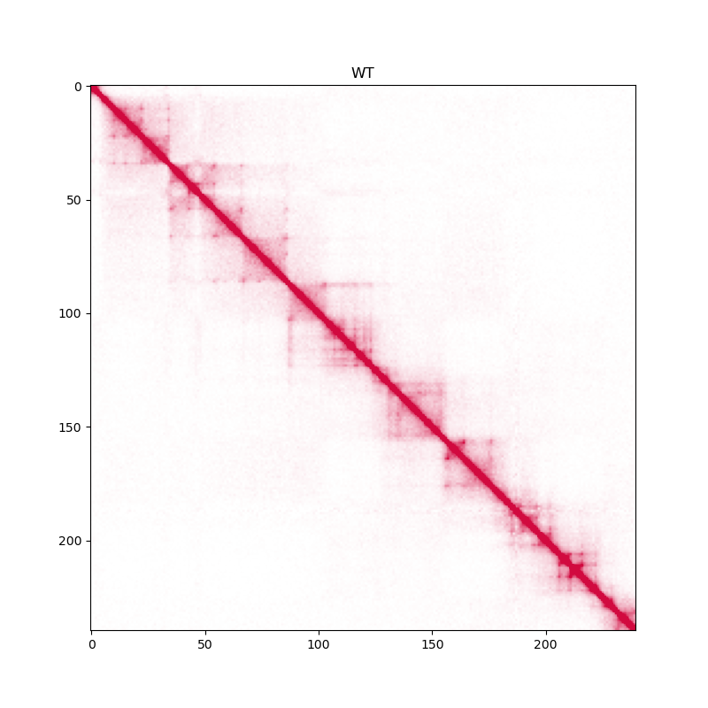

   plotHiCMatrix

drawSquareMulti
------------------------------------------------------

Visualize contact map of multiple Hi-C samples as triangle heatmaps.
The input data is a dense matrix output from `makeMatrix_intra.sh`.

.. code-block:: bash

     # linear scale
     drawSquareMulti \
        JuicerResults_hg38/Control:Control \
        JuicerResults_hg38/CTCFKD:siCTCF \
        JuicerResults_hg38/NIPBLKD:siNIBPL \
        -o SquareMulti.chr9 \
        -c chr9 --start 1000000 --end 38000000 --type VC_SQRT --vmax 20

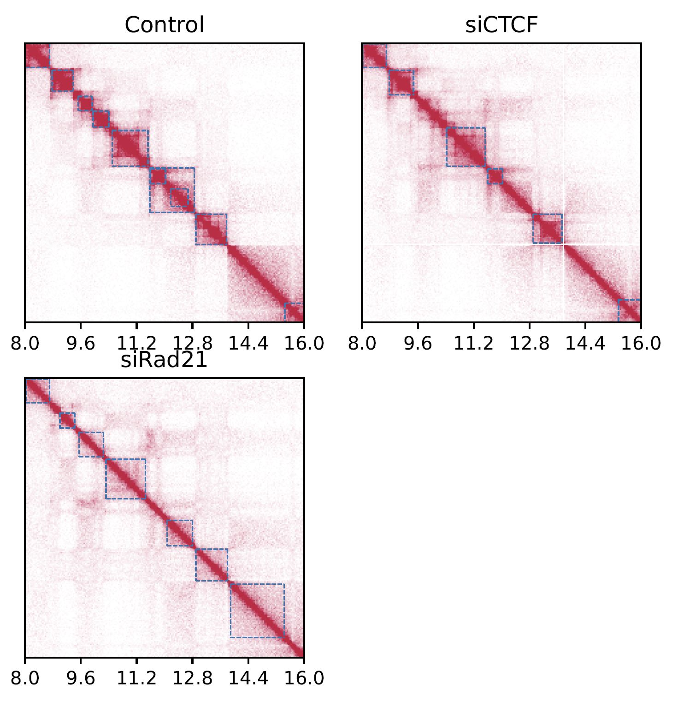

   SquareMulti

Add ``--log`` option to visualize a log-scale heatmap.

.. code-block:: bash

     # log scale
     drawSquareMulti \
        JuicerResults_hg38/Control:Control \
        JuicerResults_hg38/CTCFKD:siCTCF \
        JuicerResults_hg38/NIPBLKD:siNIBPL \
        -o SquareMulti.chr9 \
        -c chr9 --start 1000000 --end 38000000 --type VC_SQRT \
        --vmax 20 --log

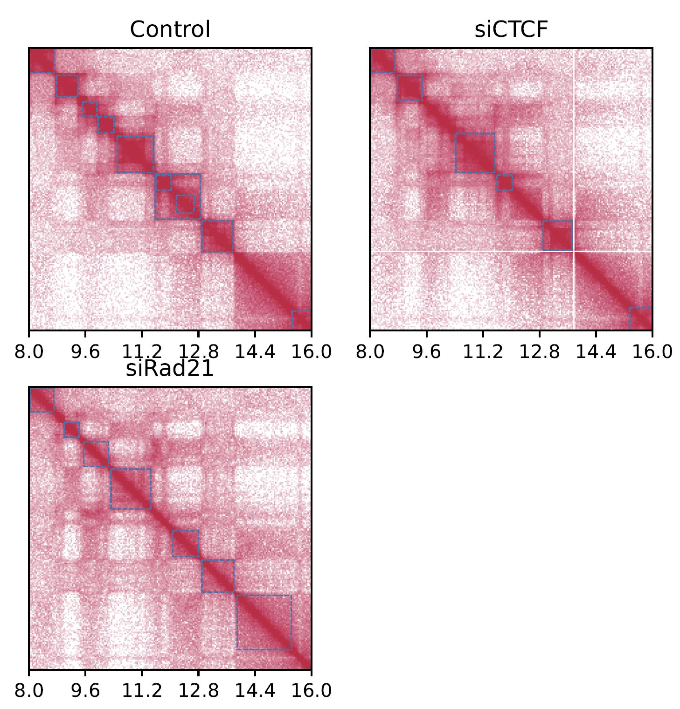

   SquareMulti (log scale)

drawSquareRatioMulti
------------------------------------------------------

``drawSquareRatioMulti`` visualizes a relative contact frequency (log scale) of 2nd to the last samples against the first sample.
The input data is a dense matrix output from `makeMatrix_intra.sh`.

.. code-block:: bash

     drawSquareRatioMulti \
        JuicerResults_hg38/Control:Control \
        JuicerResults_hg38/CTCFKD:siCTCF \
        JuicerResults_hg38/NIPBLKD:siNIBPL \
        -o drawSquareRatioMulti.chr9 \
        -c chr9 --start 1000000 --end 38000000 --type VC_SQRT 

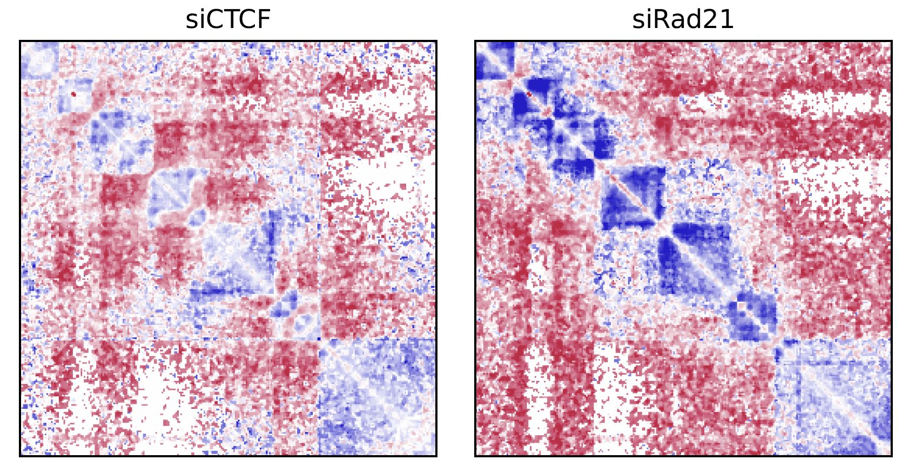

   drawSquareRatioMulti

This figure shows the relative contact frequency of 2nd (siCTCF) and 3rd (siNIPBL) against 1st (Control).

drawSquarePair
------------------------------------------------------

``drawSquarePair`` shows two samples in a single square heatmap.
The first and second samples are visualzed in the upper and bottom triagles, respectively.

.. code-block:: bash

     drawSquarePair \
         Control/Matrix/intrachromosomal/25000/observed.VC_SQRT.chr21.matrix.gz \
         Rad21KD_1/Matrix/intrachromosomal/25000/observed.VC_SQRT.chr21.matrix.gz \
         drawSquarePair.chr21 --start 24000000 --end 32000000

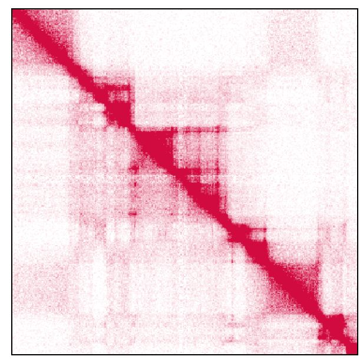

   drawSquarePair

In this case, ``Control`` and ``Rad21KD`` are visualzed in the upper and bottom triagles, respectively.

drawSquareRatioPair
------------------------------------------------------

Similar to ``drawSquarePair``, ``drawSquareRatioPair`` shows the relative contact map of two sample pairs in a single square heatmap.
This command visualize the log-scale frequency of ``sample2/sample1`` and ``sample4/sample3`` in the upper and bottom triagles, respectively.

.. code-block:: bash

     drawSquareRatioPair \
          Control_1/Matrix/intrachromosomal/25000/observed.VC_SQRT.chr21.matrix.gz \
          CTCFKD_1/Matrix/intrachromosomal/25000/observed.VC_SQRT.chr21.matrix.gz \
          Control_2/Matrix/intrachromosomal/25000/observed.VC_SQRT.chr21.matrix.gz \
          Rad21KD_1/Matrix/intrachromosomal/25000/observed.VC_SQRT.chr21.matrix.gz \
          drawSquareRatioPair.chr21 --start 24000000 --end 32000000

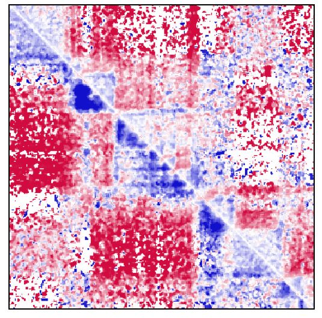

   drawSquareRatioPair

In this case, CTCFKD_1/Control_1 and Rad21KD_1/Control_2 are visualized in the upper and bottom triagles, respectively.

drawTriangleMulti
------------------------------------------------------

Visualize contact map of multiple Hi-C samples as triangle heatmaps.
The input data is a dense matrix output from `makeMatrix_intra.sh`.

.. code-block:: bash

     drawTriangleMulti \
        JuicerResults_hg38/Control:Control \
        JuicerResults_hg38/CTCFKD:siCTCF \
        -o drawTriangleMulti.chr9 \
        -c chr9 --start 1000000 --end 38000000 --type VC_SQRT -d 5000000

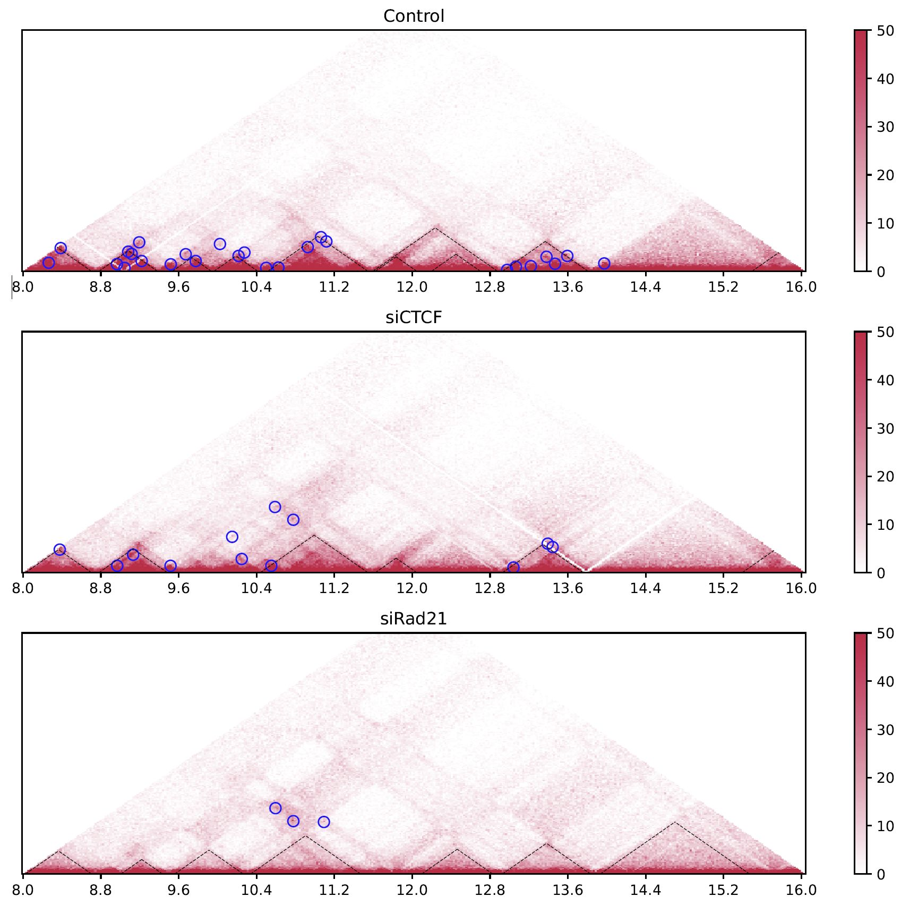

   drawTriangleMulti

The black dashed lines and blue circles indicate TADs and loops, respectively.

drawTrianglePair
------------------------------------------------------

Visualize a contact frequency of the first and second sample in upper and lower triangles, respectively.

.. code-block:: bash

     drawTrianglePair \
        JuicerResults_hg38/Control:Control \
        JuicerResults_hg38/CTCFKD:siCTCF \
        -o drawTrianglePair.chr9 \
        -c chr9 --start 1000000 --end 38000000 --type VC_SQRT -d 8000000

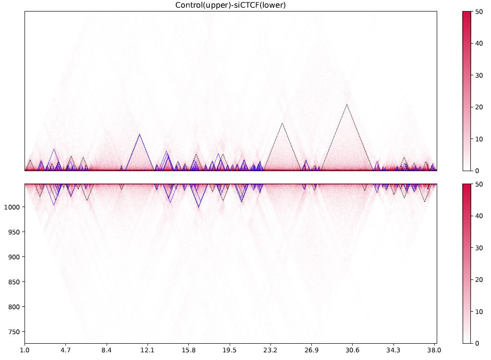

   drawTrianglePair

The black dashed lines and blue circles indicate TADs and loops, respectively.

drawTriangleRatioMulti
------------------------------------------------------

Visualize a relative contact frequency (log scale) of 2nd to the last samples against the first sample.
The input data is a dense matrix output from `makeMatrix_intra.sh`.

.. code-block:: bash

     drawTriangleRatioMulti \
        JuicerResults_hg38/Control:Control \
        JuicerResults_hg38/CTCFKD:siCTCF \
        JuicerResults_hg38/NIPBLKD:siNIBPL \
        -o drawTriangleRatioMulti.chr9 \
        -c chr9 --start 1000000 --end 38000000 --type VC_SQRT -d 5000000

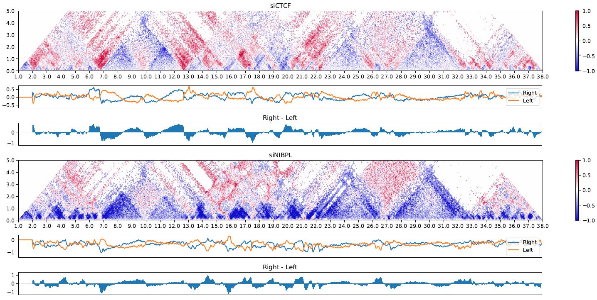

   drawTriangleRatioMulti

The bottom line plots are Directional frequency ratio (see `Directional frequency ratio <https://custardpy.readthedocs.io/en/latest/content/Visualization.html#directional-frequency-ratio>`_).

plotHiCfeature
------------------------------------------------------

``plotHiCfeature`` can visualize various features values of Hi-C for multiple samples.

.. code-block:: bash

     usage: plotHiCfeature [-h] [-o OUTPUT] [-c CHR] [--type TYPE]
                           [--distance DISTANCE] [-r RESOLUTION] [-s START]
                           [-e END] [--multi] [--multidiff] [--compartment] [--di]
                           [--dfr] [--dfr_right] [--dfr_left] [-d VIZDISTANCEMAX]
                           [--v4c] [--vmax VMAX] [--vmin VMIN] [--anchor ANCHOR]
                           [input [input ...]]
     
     positional arguments:
       input                 <Input directory>:<label>
     
     optional arguments:
       -h, --help            show this help message and exit
       -o OUTPUT, --output OUTPUT
                             Output prefix
       -c CHR, --chr CHR     chromosome
       --type TYPE           normalize type (default: SCALE)
       --distance DISTANCE   distance for DI (default: 500000)
       -r RESOLUTION, --resolution RESOLUTION
                             resolution (default: 25000)
       -s START, --start START
                             start bp (default: 0)
       -e END, --end END     end bp (default: 1000000)
       --multi               plot MultiInsulation Score
       --multidiff           plot differential MultiInsulation Score
       --compartment         plot Compartment (eigen)
       --di                  plot Directionaly Index
       --dfr                 plot DirectionalFreqRatio
       --dfr_right           (with --dfr) plot DirectionalFreqRatio (Right)
       --dfr_left            (with --dfr) plot DirectionalFreqRatio (Left)
       -d VIZDISTANCEMAX, --vizdistancemax VIZDISTANCEMAX
                             max distance in heatmap
       --v4c                 plot virtual 4C from Hi-C data
       --vmax VMAX           max value of color bar (default: 50)
       --vmin VMIN           min value of color bar (default: 0)
       --anchor ANCHOR       (for --v4c) anchor point

- ``Input`` should be "<sample directory>:<label>".

    - ``<sample directory>`` is the output directory by ``custardpy_juicer``.
    - ``<label>`` is the label used in the figure.
- In default, ``plotHiCfeature`` uses a 25-kbp bin matrix. Supply ``-r`` option to change the resolution.
- ``type`` is the normalization type defined by Juicer (SCALE/KR/VC_SQRT/NONE).

Insulation score
+++++++++++++++++++++++++++

By default, ``plotHiCfeature`` outputs a single insulation score (500 kbp distance).

.. code-block:: bash

     chr=chr20
     start=8000000
     end=16000000
     norm=SCALE
     plotHiCfeature \
          JuicerResults_hg38/Hap1-A:Control \
          JuicerResults_hg38/WaplKO_3.3-A:WaplKO \
          -c $chr --start $start --end $end \
          --type $norm -d 5000000 \
          -o IS.$chr.$start-$end

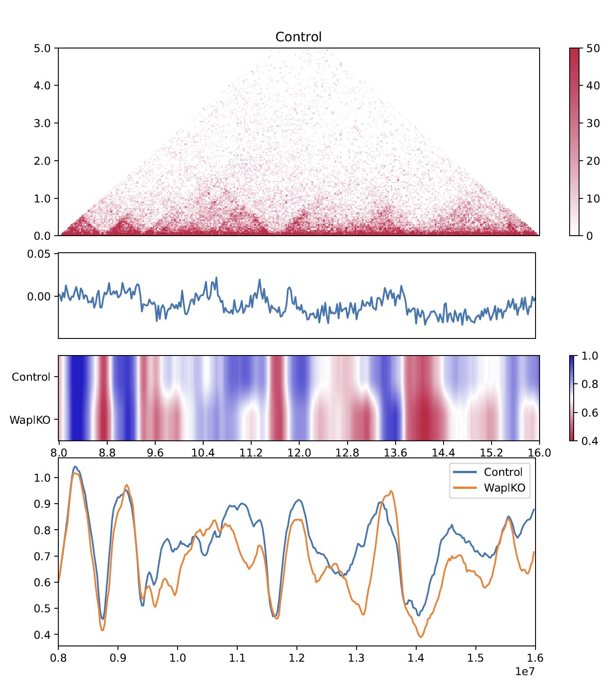

     Insulation score

``plotHiCfeature`` always draws compartment PC1 (blue line plot in the second row) to roughly estimate compartments A/B.
The third and fourth rows are the heatmap and line plot for the feature value specified (insulation score in this case).

Multi-insulation score
+++++++++++++++++++++++++++

``plotHiCfeature`` can also calculate a "multi-scale insulation score `[Crane et al., Nature, 2015] <https://www.nature.com/articles/nature14450>`_"
ranging 100 kbp to 1 Mbp by supplying ``--multi`` option.

.. code-block:: bash

     chr=chr20
     start=8000000
     end=16000000
     norm=SCALE
     plotHiCfeature \
          JuicerResults_hg38/Hap1-A:Control \
          JuicerResults_hg38/WaplKO_3.3-A:WaplKO \
          -c $chr --start $start --end $end \
          --multi --type $norm -d 5000000 \
          -o MultiIS.$chr.$start-$end

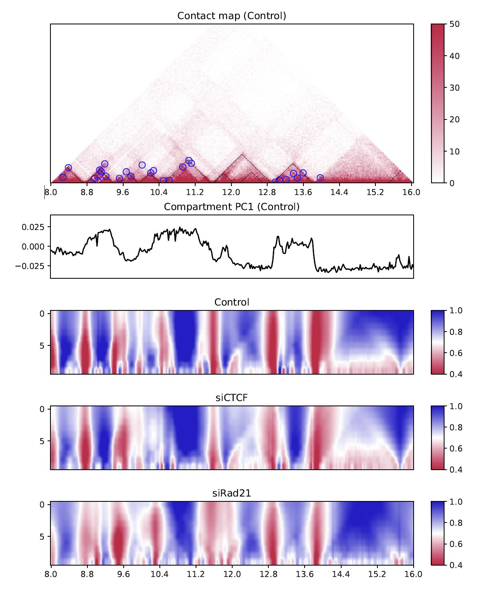

     Multi-insulation score

Red regions in the heatmap indicate the insulated regions (TAD boundary-like).
The lower and upper sides of the heatmap are 100 kbp to 1 Mbp distances, respectively.

Differential multi-insulation score
++++++++++++++++++++++++++++++++++++++++++++++++

To directory investigate the difference of multi-insulation score, we provide **differential multi-insulation score** by ``--multidiff`` option.

.. code-block:: bash

     chr=chr20
     start=8000000
     end=16000000
     norm=SCALE
     plotHiCfeature \
          JuicerResults_hg38/Hap1-A:Control \
          JuicerResults_hg38/WaplKO_3.3-A:WaplKO \
          -c $chr --start $start --end $end \
          --multidiff --type $norm -d 5000000 \
          -o MultiISdiff.$chr.$start-$end

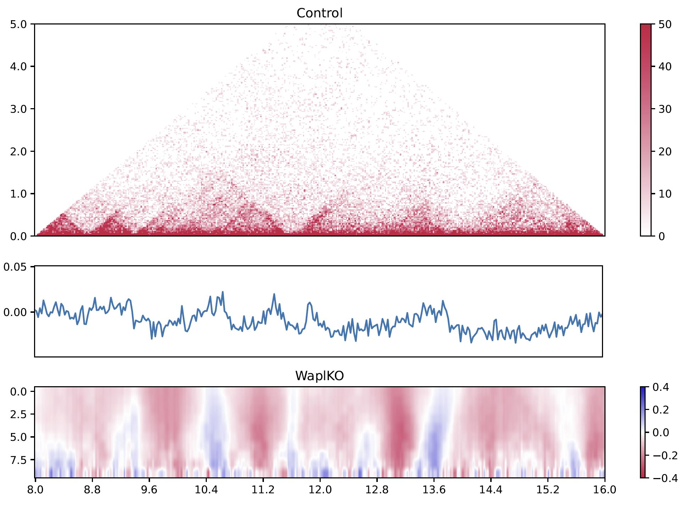

     Differential multi-insulation score

The heatmap shows the difference **sample2 - sample1** (WaplKO - Control in this case). We can see that the insulation level increases overall by WAPL depletion.

Compartment PC1
+++++++++++++++++++++++++++

While the blue line in the second row shows the PC1 value of the first sample, 
``plotHiCfeature --compartment`` visualizes the PC1 values for multiple samples. This plot can be used to identify compartment switching.

.. code-block:: bash

     chr=chr20
     start=8000000
     end=16000000
     norm=SCALE
     plotHiCfeature \
          JuicerResults_hg38/Hap1-A:Control \
          JuicerResults_hg38/WaplKO_3.3-A:WaplKO \
          -c $chr --start $start --end $end \
          --compartment --type $norm -d 5000000 \
          -o Compartment.$chr.$start-$end

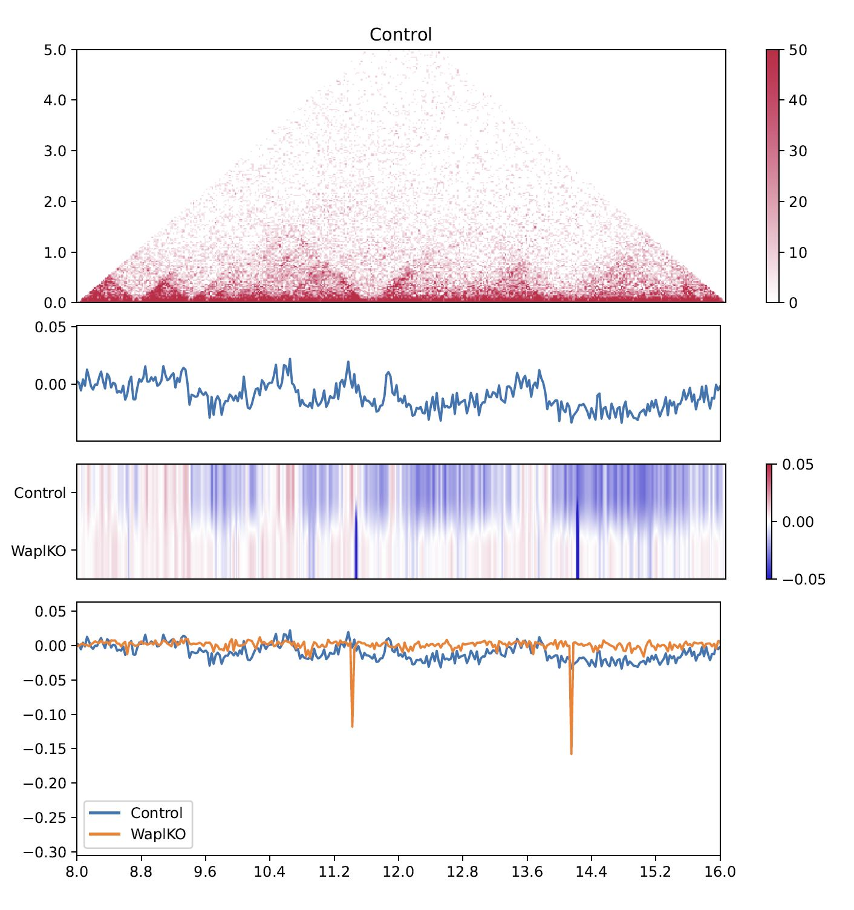

     Compartment PC1

Directionality index
+++++++++++++++++++++++++++

The directionality index identifies TAD boundaries by capturing the bias in contact frequency up- and downstream of a TAD `[Dixon et al., Nature, 2012] <https://www.nature.com/articles/nature11082>`_. 
The "left side" and "right side" of a TAD are likely to have positve and negative values, respectively.

.. code-block:: bash

     chr=chr20
     start=8000000
     end=16000000
     norm=SCALE
     plotHiCfeature \
          JuicerResults_hg38/Hap1-A:Control \
          JuicerResults_hg38/WaplKO_3.3-A:WaplKO \
          -c $chr --start $start --end $end \
          --di --type $norm -d 5000000 \
          -o DI.$chr.$start-$end

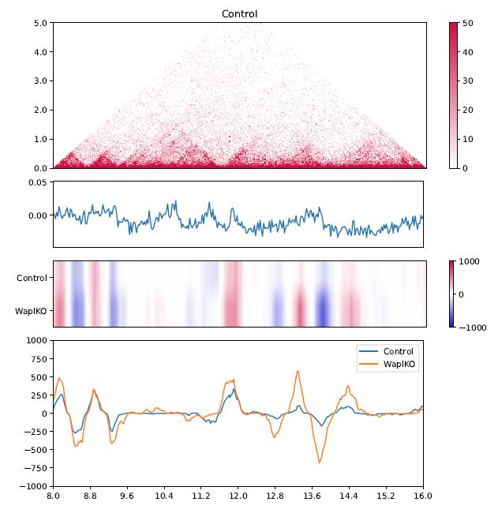

     Directionality index

Directional relative frequency
++++++++++++++++++++++++++++++++++++++

Directional relative frequency is a score our group previously proposed `[Wang and Nakato, Brief Bioinform, 2021] <https://academic.oup.com/bib/article/23/1/bbab509/6446983>`_.
This score estimates the inconsistency of relative contact frequence (log scale) between the left side (3′) and right side (5′).

.. code-block:: bash

     chr=chr20
     start=8000000
     end=16000000
     norm=SCALE
     plotHiCfeature \
          JuicerResults_hg38/Hap1-A:Control \
          JuicerResults_hg38/WaplKO_3.3-A:WaplKO \
          -c $chr --start $start --end $end \
          --drf --type $norm -d 5000000 \
          -o DRF.$chr.$start-$end

.. figure:: img/plotHiCfeature_dfr.jpg
     :width: 400px
     :align: center
     :alt: Alternate Text

     Directional relative frequency

See also `drawTriangleRatioMulti <https://custardpy.readthedocs.io/en/latest/content/Visualization.html#drawtriangleratiomulti>`_.

plotCompartmentGenome
------------------------------------------------------

Plot a PC1 value of multiple samples for the whole genome.

.. code-block:: bash

     plotCompartmentGenome [-h] [--type TYPE] [-r RESOLUTION] [--heatmap]
                       [input [input ...]] output
     Example:
        plotCompartmentGenome Control_1:Control CTCFKD_1:siCTCF NIPBLKD_1:siNIBPL \
               CompartmentGenome -r 25000 --type VC_SQRT

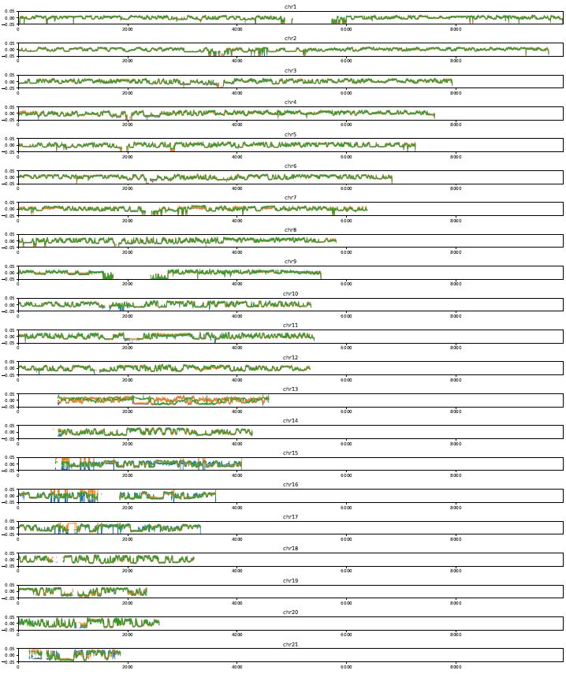

   plotCompartmentGenome

plotInsulationScore
------------------------------------------------------

Plot a line graph of insulation score. The input data is a dense matrix output from `makeMatrix_intra.sh`.

.. code-block:: bash

     plotInsulationScore [-h] [--num4norm NUM4NORM] [--distance DISTANCE]
                                 [--sizex SIZEX] [--sizey SIZEY]
                                 matrix output resolution
     Example:
        plotInsulationScore WT/intrachromosomal/25000/observed.KR.chr7.matrix.gz InsulationScore_WT.chr7.png 25000

.. figure:: img/InsulationScore.png
   :width: 700px
   :align: center
   :alt: Alternate

   InsulationScore

plotMultiScaleInsulationScore
------------------------------------------------------

Plot multi-scale insulation scores from Juicer matrix

.. code-block:: bash

     plotMultiScaleInsulationScore [-h] [--num4norm NUM4NORM]
                                   [--sizex SIZEX] [--sizey SIZEY]
                                   matrix output resolution
     Example:
        plotInsulationScore WT/intrachromosomal/25000/observed.KR.chr7.matrix.gz MultiInsulationScore_WT.chr7.png 25000

