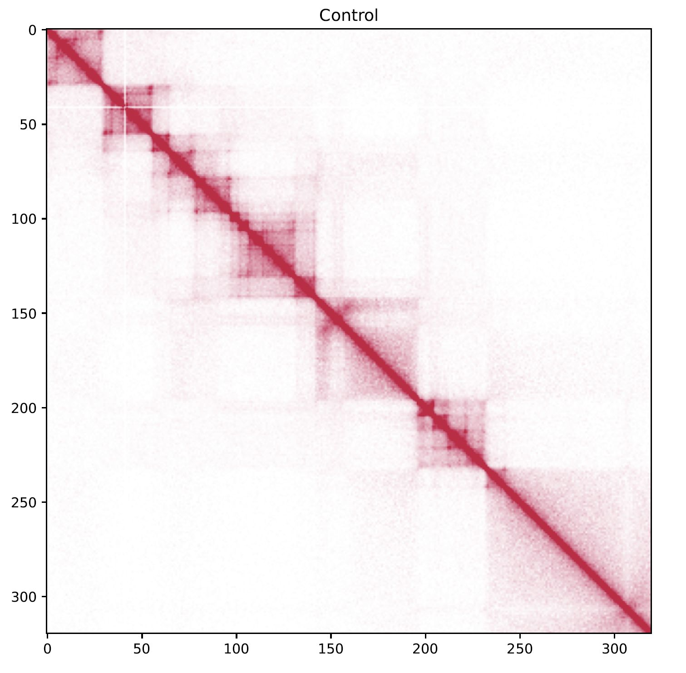
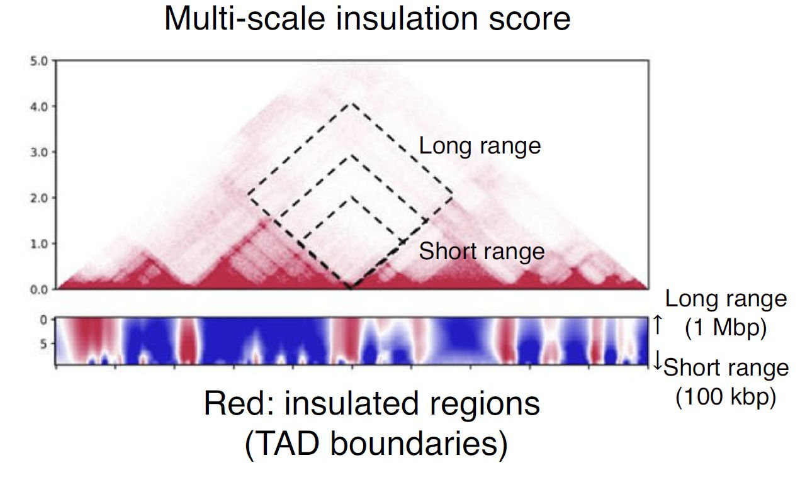
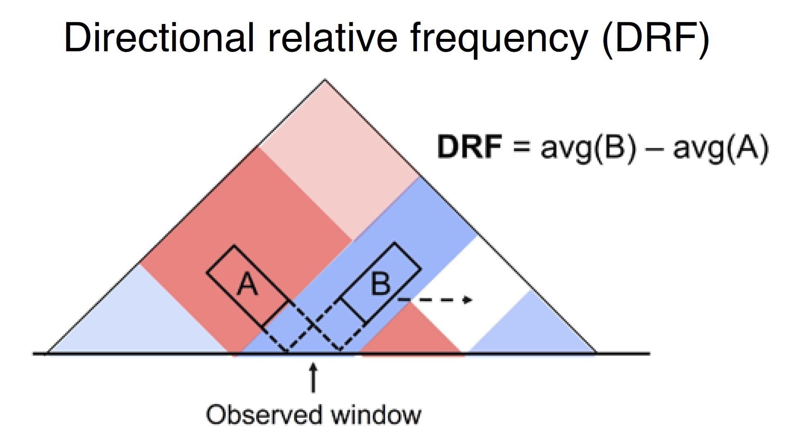
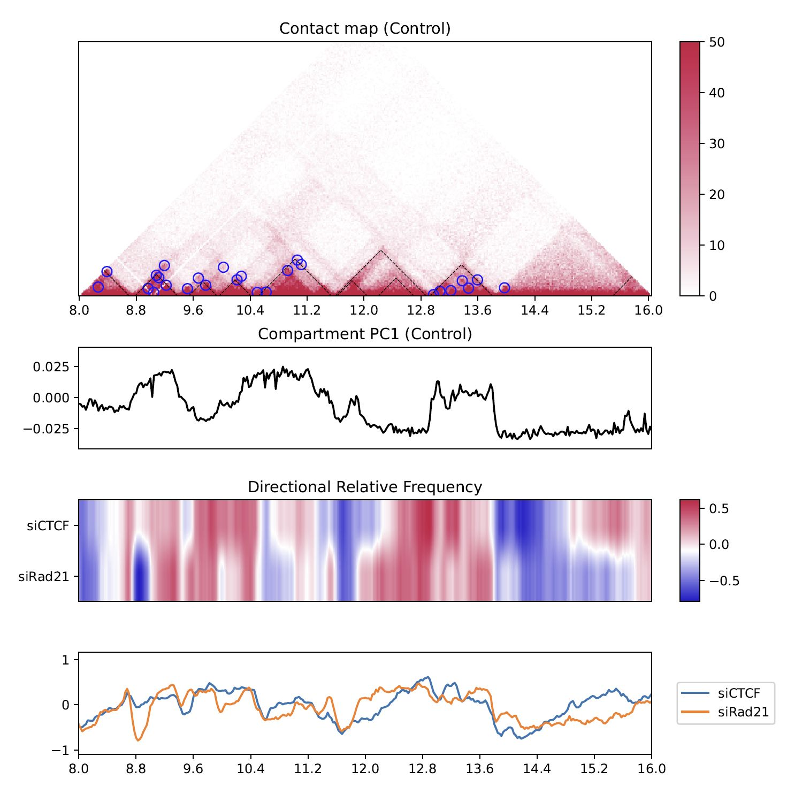
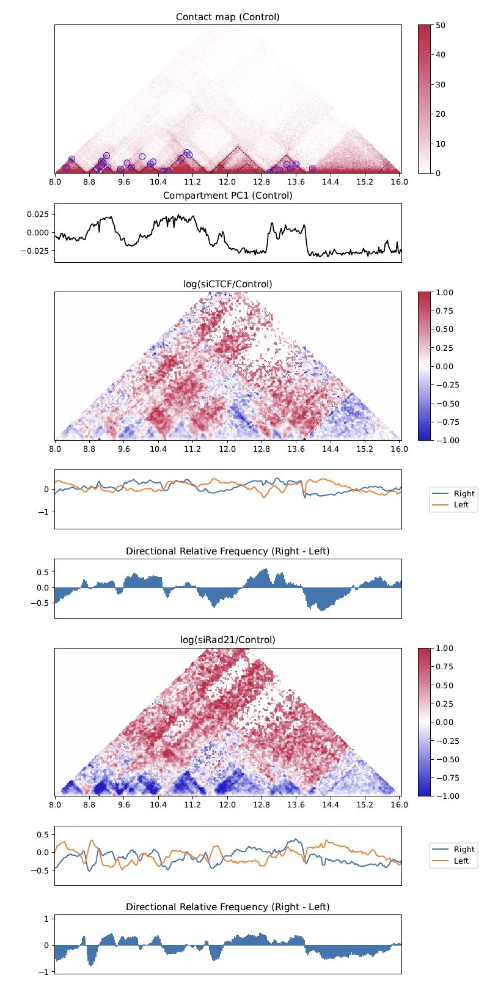
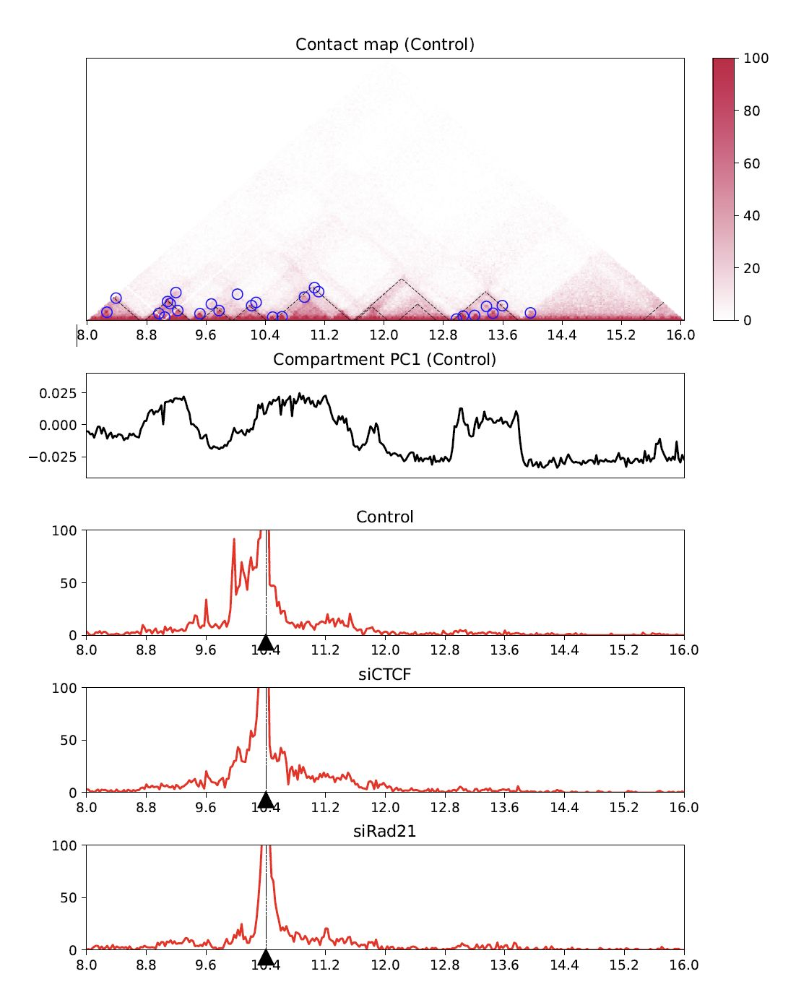
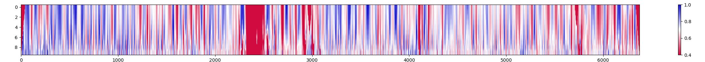

Visualization
===============================

This page introduces the commands in **CustardPy** to plot the 3D visualization.
These commands use the output data generated by ``custardpy_juicer`` or ``custardpy_process_hic``.

Here we use the example data used in :doc:`StepbyStep`.

.. contents:: 
   :depth: 3

plotHiCMatrix
----------------------------------------------------------------

``plotHiCMatrix`` visualizes a contact map as a simple square heatmap. The input data is a dense matrix output from ``makeMatrix_intra.sh``.
The contact level is normalized by the total number of mapped reads for the chromosome.

.. code-block:: bash

    plotHiCMatrix <matrix> <output name> <start> <end> <title in figure>

Example:

.. code-block:: bash

     chr=chr20
     start=8000000
     end=16000000
     resolution=25000
     norm=SCALE

     matrix=CustardPyResults_Hi-C/Juicer_hg38/Control/Matrix/intrachromosomal/$resolution/observed.$norm.$chr.matrix.gz

     plotHiCMatrix \
          $matrix \
          ContactMap.Control.$chr.$start-$end.pdf \
          $start $end Control

   plotHiCMatrix

drawSquareMulti
------------------------------------------------------

``drawSquareMulti`` visualizes the contact map of multiple Hi-C samples as triangle heatmaps.
The input data is a dense matrix output from ``makeMatrix_intra.sh``.

.. code-block:: bash

     Resdir=CustardPyResults_Hi-C/Juicer_hg38
     norm=SCALE
     resolution=25000
     chr=chr20
     start=8000000
     end=16000000

     # linear scale
     drawSquareMulti \
       $Resdir/Control:Control \
       $Resdir/siCTCF:siCTCF \
       $Resdir/siRad21:siRad21 \
       -o SquareMulti.$chr \
       -c $chr --start $start --end $end --type $norm -r $resolution

.. figure:: img/SquareMulti.jpg
   :width: 500px
   :align: center
   :alt: Alternate

   SquareMulti

The dashed squares indicate TADs.

Add ``--log`` option to visualize a log-scale heatmap.

.. code-block:: bash

     # log scale
     drawSquareMulti \
       $Resdir/Control:Control \
       $Resdir/siCTCF:siCTCF \
       $Resdir/siRad21:siRad21 \
       -o SquareMulti.$chr \
       -c $chr --start $start --end $end \
       --type $norm -r $resolution --log

.. figure:: img/SquareMulti.log.jpg
   :width: 500px
   :align: center
   :alt: Alternate

   SquareMulti (log scale)

drawSquareRatioMulti
------------------------------------------------------

``drawSquareRatioMulti`` visualizes a relative contact frequency (log scale) of 2nd to the last samples against the first sample.
The input data is a dense matrix output from ``makeMatrix_intra.sh``.

.. code-block:: bash

     Resdir=CustardPyResults_Hi-C/Juicer_hg38
     norm=SCALE
     resolution=25000
     chr=chr20
     start=8000000
     end=16000000

     drawSquareRatioMulti \
          $Resdir/Control:Control \
          $Resdir/siCTCF:siCTCF \
          $Resdir/siRad21:siRad21 \
          -o SquareRatioMulti.$chr \
          -c $chr --start $start --end $end --type $norm -r $resolution

.. figure:: img/drawSquareRatioMulti.jpg
   :width: 500px
   :align: center
   :alt: Alternate

   drawSquareRatioMulti

This figure shows the relative contact frequency of 2nd (siCTCF) and 3rd (siRad21) against 1st (Control).

drawSquarePair
------------------------------------------------------

``drawSquarePair`` shows two samples in a single square heatmap.
The first and second samples are visualzed in the upper and bottom triagles, respectively.

.. code-block:: bash

     Resdir=CustardPyResults_Hi-C/Juicer_hg38
     norm=SCALE
     resolution=25000
     chr=chr20
     start=8000000
     end=16000000

     drawSquarePair \
          $Resdir/Control/Matrix/intrachromosomal/$resolution/observed.$norm.$chr.matrix.gz:Control \
          $Resdir/siRad21/Matrix/intrachromosomal/$resolution/observed.$norm.$chr.matrix.gz:siRad21 \
          -o SquarePair.$chr --start $start --end $end -r $resolution

.. figure:: img/drawSquarePair.jpg
   :width: 400px
   :align: center
   :alt: Alternate

   drawSquarePair

The command visualizes Control and siRad21 in the upper and bottom triagles, respectively.

drawSquareRatioPair
------------------------------------------------------

Similar to ``drawSquarePair``, ``drawSquareRatioPair`` shows the relative contact map of two sample pairs in a single square heatmap.
This command visualize the log-scale frequency of ``sample2/sample1`` and ``sample4/sample3`` in the upper and bottom triagles, respectively.

.. code-block:: bash

     Resdir=CustardPyResults_Hi-C/Juicer_hg38
     norm=SCALE
     resolution=25000
     chr=chr20
     start=8000000
     end=16000000

     drawSquareRatioPair \
          $Resdir/Control/Matrix/intrachromosomal/$resolution/observed.$norm.$chr.matrix.gz:Control \
          $Resdir/siRad21/Matrix/intrachromosomal/$resolution/observed.$norm.$chr.matrix.gz:siRad21 \
          $Resdir/Control/Matrix/intrachromosomal/$resolution/observed.$norm.$chr.matrix.gz:Control \
          $Resdir/siCTCF/Matrix/intrachromosomal/$resolution/observed.$norm.$chr.matrix.gz:siCTCF \
          -o drawSquareRatioPair.$chr --start $start --end $end -r $resolution

.. figure:: img/drawSquareRatioPair.jpg
   :width: 400px
   :align: center
   :alt: Alternate

   drawSquareRatioPair

In this case, siRad21/Control and siCTCF/Control are visualized in the upper and bottom triagles, respectively.

drawTriangleMulti
------------------------------------------------------

``drawTriangleMulti`` visualizes the contact map of multiple Hi-C samples as triangle heatmaps.
The input data is a dense matrix output from ``makeMatrix_intra.sh``.

.. code-block:: bash

     Resdir=CustardPyResults_Hi-C/Juicer_hg38
     norm=SCALE
     resolution=25000
     chr=chr20
     start=8000000
     end=16000000
     
     drawTriangleMulti \
          $Resdir/Control:Control \
          $Resdir/siCTCF:siCTCF \
          $Resdir/siRad21:siRad21 \
          -o TriangleMulti.$chr \
          -c $chr --start $start --end $end --type $norm -d 5000000 -r $resolution

.. figure:: img/drawTriangleMulti.jpg
   :width: 600px
   :align: center
   :alt: Alternate

   drawTriangleMulti

The black dashed lines and blue circles indicate TADs and loops, respectively.

drawTrianglePair
------------------------------------------------------

``drawTrianglePair`` visualizes a contact map of the first and second sample in upper and lower triangles, respectively.

.. code-block:: bash

     Resdir=CustardPyResults_Hi-C/Juicer_hg38
     norm=SCALE
     resolution=25000
     chr=chr20
     start=8000000
     end=16000000

     drawTrianglePair \
          $Resdir/Control:Control \
          $Resdir/siRad21:siRad21 \
          -o TrianglePair.$chr \
          -c $chr --start $start --end $end --type $norm -d 5000000 -r $resolution

.. figure:: img/drawTrianglePair.jpg
   :width: 500px
   :align: center
   :alt: Alternate

   drawTrianglePair

The black dashed lines and blue circles indicate TADs and loops, respectively.

plotHiCfeature
------------------------------------------------------

``plotHiCfeature`` can visualize various features values of chromatin folding for multiple samples.

.. code-block:: bash

     plotHiCfeature [-h] [-o OUTPUT] [-c CHR] [--type TYPE]
                    [--distance DISTANCE] [-r RESOLUTION] [-s START]
                    [-e END] [--multi] [--multidiff] [--compartment] [--di]
                    [--drf] [--drf_right] [--drf_left]
                    [--triangle_ratio_multi] [-d VIZDISTANCEMAX] [--v4c]
                    [--vmax VMAX] [--vmin VMIN] [--vmax_ratio VMAX_RATIO]
                    [--vmin_ratio VMIN_RATIO] [--anchor ANCHOR]
                    [--xsize XSIZE]
                    [input [input ...]]

     positional arguments:
          input                 <Input directory>:<label>

     optional arguments:
          -h, --help            show this help message and exit
          -o OUTPUT, --output OUTPUT
                              Output prefix
          -c CHR, --chr CHR     chromosome
          --type TYPE           normalize type (default: SCALE)
          --distance DISTANCE   distance for DI (default: 500000)
          -r RESOLUTION, --resolution RESOLUTION
                              resolution (default: 25000)
          -s START, --start START
                              start bp (default: 0)
          -e END, --end END     end bp (default: 1000000)
          --multi               plot MultiInsulation Score
          --multidiff           plot differential MultiInsulation Score
          --compartment         plot Compartment (eigen)
          --di                  plot Directionaly Index
          --drf                 plot Directional Relative Frequency
          --drf_right           (with --drf) plot DirectionalRelativeFreq (Right)
          --drf_left            (with --drf) plot DirectionalRelativeFreq (Left)
          --triangle_ratio_multi
                              plot Triangle ratio multi
          -d VIZDISTANCEMAX, --vizdistancemax VIZDISTANCEMAX
                              max distance in heatmap
          --v4c                 plot virtual 4C from Hi-C data
          --vmax VMAX           max value of color bar (default: 50)
          --vmin VMIN           min value of color bar (default: 0)
          --vmax_ratio VMAX_RATIO
                              max value of color bar for logratio (default: 1)
          --vmin_ratio VMIN_RATIO
                              min value of color bar for logratio (default: -1)
          --anchor ANCHOR       (for --v4c) anchor point
          --xsize XSIZE         xsize for figure (default: max(length/2M, 10))

- ``Input`` should be "<sample directory>:<label>".

     - ``<sample directory>`` is the output directory by ``custardpy_juicer``.
     - ``<label>`` is the label used in the figure.

- In default, ``plotHiCfeature`` uses a 25-kbp bin matrix. Supply ``-r`` option to change the resolution.
- ``type`` is the normalization type defined by Juicer (SCALE/KR/VC_SQRT/NONE).

Insulation score
+++++++++++++++++++++++++++

By default, ``plotHiCfeature`` outputs a single insulation score (500 kbp distance).

.. code-block:: bash

     Resdir=CustardPyResults_Hi-C/Juicer_hg38
     norm=SCALE
     resolution=25000
     chr=chr20
     start=8000000
     end=16000000

     plotHiCfeature \
          $Resdir/Control:Control \
          $Resdir/siCTCF:siCTCF \
          $Resdir/siRad21:siRad21 \
          -c $chr --start $start --end $end -r $resolution \
          --type $norm -d 5000000 \
          -o IS.$chr.$start-$end

.. figure:: img/plotHiCfeature_IS.jpg
     :width: 500px
     :align: center
     :alt: Alternate Text

     Insulation score

``plotHiCfeature`` always draws compartment PC1 (line plot in the second row) to roughly estimate compartments A and B.
The third and fourth rows are the heatmap and line plot for the feature value specified (insulation score in this case).

Multi-insulation score
+++++++++++++++++++++++++++

``plotHiCfeature`` can also calculate a "multi-scale insulation score" `[Crane et al., Nature, 2015] <https://www.nature.com/articles/nature14450>`_ by supplying ``--multi`` option.

     Schematic illustration of multi-insulation score

Red regions in the heatmap indicate the insulated regions (TAD boundary-like).
The lower and upper sides of the heatmap are 100 kbp to 1 Mbp distances, respectively.

.. code-block:: bash

     Resdir=CustardPyResults_Hi-C/Juicer_hg38
     norm=SCALE
     resolution=25000
     chr=chr20
     start=8000000
     end=16000000

     plotHiCfeature \
          $Resdir/Control:Control \
          $Resdir/siCTCF:siCTCF \
          $Resdir/siRad21:siRad21 \
          -c $chr --start $start --end $end -r $resolution \
          --multi --type $norm -d 5000000 \
          -o MultiIS.$chr.$start-$end

.. figure:: img/plotHiCfeature_multiIS.jpg
     :width: 500px
     :align: center
     :alt: Alternate Text

     Multi-insulation score

Differential multi-insulation score
++++++++++++++++++++++++++++++++++++++++++++++++

To directory investigate the difference of multi-insulation score, we provide **differential multi-insulation score** by ``--multidiff`` option.

.. code-block:: bash

     Resdir=CustardPyResults_Hi-C/Juicer_hg38
     norm=SCALE
     resolution=25000
     chr=chr20
     start=8000000
     end=16000000

     plotHiCfeature \
          $Resdir/Control:Control \
          $Resdir/siCTCF:siCTCF \
          $Resdir/siRad21:siRad21 \
          -c $chr --start $start --end $end -r $resolution \
          --multidiff --type $norm -d 5000000 \
          -o MultiISdiff.$chr.$start-$end

.. figure:: img/plotHiCfeature_multiISdiff.jpg
     :width: 500px
     :align: center
     :alt: Alternate Text

     Differential multi-insulation score

The heatmap shows the difference against the first sample (``siCTCF - Control`` and ``siRad21 - Control`` in this case). 

Compartment PC1
+++++++++++++++++++++++++++

While the line plot in the second row shows the PC1 value of the first sample,
``plotHiCfeature --compartment`` visualizes the PC1 values for multiple samples.
This plot can be used to explore compartment switching.

.. code-block:: bash

     Resdir=CustardPyResults_Hi-C/Juicer_hg38
     norm=SCALE
     resolution=25000
     chr=chr20
     start=8000000
     end=16000000

     plotHiCfeature \
          $Resdir/Control:Control \
          $Resdir/siCTCF:siCTCF \
          $Resdir/siRad21:siRad21 \
          -c $chr --start $start --end $end -r $resolution \
          --compartment --type $norm -d 5000000 \
          -o Compartment.$chr.$start-$end

.. figure:: img/plotHiCfeature_compartment.jpg
     :width: 500px
     :align: center
     :alt: Alternate Text

     Compartment PC1

Directionality index
+++++++++++++++++++++++++++

The directionality index identifies TAD boundaries by capturing the bias in contact frequency up- and downstream of a TAD `[Dixon et al., Nature, 2012] <https://www.nature.com/articles/nature11082>`_.
The "left side" and "right side" of a TAD are likely to have positve and negative values, respectively.

.. code-block:: bash

     Resdir=CustardPyResults_Hi-C/Juicer_hg38
     norm=SCALE
     resolution=25000
     chr=chr20
     start=8000000
     end=16000000

     plotHiCfeature \
          $Resdir/Control:Control \
          $Resdir/siCTCF:siCTCF \
          $Resdir/siRad21:siRad21 \
          -c $chr --start $start --end $end -r $resolution \
          --di --type $norm -d 5000000 \
          -o DI.$chr.$start-$end

.. figure:: img/plotHiCfeature_DI.jpg
     :width: 500px
     :align: center
     :alt: Alternate Text

     Directionality index

Directional relative frequency
++++++++++++++++++++++++++++++++++++++

**Directional relative frequency (DRF)** is a score that our group previously proposed `[Nakato et al, Nature Communications, 2023] <https://doi.org/10.1038/s41467-023-41316-4>`_.
This score estimates the inconsistency of relative contact frequence (log scale) between the left side (3′) and right side (5′).

     Schematic illustration of directional relative frequency

.. code-block:: bash

     Resdir=CustardPyResults_Hi-C/Juicer_hg38
     norm=SCALE
     resolution=25000
     chr=chr20
     start=8000000
     end=16000000

     plotHiCfeature \
          $Resdir/Control:Control \
          $Resdir/siCTCF:siCTCF \
          $Resdir/siRad21:siRad21 \
          -c $chr --start $start --end $end -r $resolution \
          --drf --type $norm -d 5000000 \
          -o DRF.$chr.$start-$end

     Directional relative frequency

drawTriangleRatioMulti
++++++++++++++++++++++++++++++++++++++

``--triangle_ratio_multi`` visualizes a relative contact frequency (log scale) of 2nd to the last samples against the first sample. Directional relative frequency is also shown.

.. code-block:: bash

     Resdir=CustardPyResults_Hi-C/Juicer_hg38
     norm=SCALE
     resolution=25000
     chr=chr20
     start=8000000
     end=16000000

     plotHiCfeature \
          $Resdir/Control:Control \
          $Resdir/siCTCF:siCTCF \
          $Resdir/siRad21:siRad21 \
          -o TriangleRatioMulti.$chr \
          -c $chr --start $start --end $end -r $resolution \
          --triangle_ratio_multi --type $norm -d 5000000

     TriangleRatioMulti

"Right" and "left" shown as blue and orange line plots in the second row indicate the "B" and "A" in Fig. 4.15.

Output the logfold change matrices
========================================

``--triangle_ratio_multi`` has an option ``--output_logfc_matrix`` to output the logfold change matrices used for the visualization.
This command is useful if you want to do a downstream analysis using the matrices.

Virtual 4C
++++++++++++++++++++++++++++++++++++++

``Virtual 4C`` visualizes a 4C-like plot (interation from the anchor site) using Hi-C data.
Use ``--anchor`` option to specify the anchor site.

.. code-block:: bash

     Resdir=CustardPyResults_Hi-C/Juicer_hg38
     norm=SCALE
     resolution=25000
     chr=chr20
     start=8000000
     end=16000000

     plotHiCfeature \
          $Resdir/Control:Control \
          $Resdir/siCTCF:siCTCF \
          $Resdir/siRad21:siRad21 \
          -o virtual4C.$chr \
          -c $chr --start $start --end $end -r $resolution \
          --v4c --anchor 10400000 --vmax 100 --type $norm

     Virtual 4C

plotCompartmentGenome
------------------------------------------------------

Plot a PC1 value of multiple samples for the whole genome.

.. code-block:: bash

     Resdir=CustardPyResults_Hi-C/Juicer_hg38
     norm=SCALE
     resolution=25000
     chr=chr20
     start=8000000
     end=16000000

     plotCompartmentGenome
          $Resdir/Control:Control \
          $Resdir/siCTCF:siCTCF \
          $Resdir/siRad21:siRad21 \
          -o CompartmentGenome -r 25000 --type VC_SQRT

.. figure:: img/plotCompartmentGenome.jpg
   :width: 700px
   :align: center
   :alt: Alternate

   plotCompartmentGenome

plotInsulationScore
------------------------------------------------------

Plot a line graph of insulation score. The input data is a dense matrix output from ``makeMatrix_intra.sh``.

.. code-block:: bash

     plotInsulationScore [-h] [--num4norm NUM4NORM] [--distance DISTANCE]
                                 [--sizex SIZEX] [--sizey SIZEY]
                                 matrix output resolution
     Example:
        plotInsulationScore WT/intrachromosomal/25000/observed.KR.chr7.matrix.gz InsulationScore_WT.chr7.png 25000

.. figure:: img/InsulationScore.png
   :width: 700px
   :align: center
   :alt: Alternate

   InsulationScore

plotMultiScaleInsulationScore
------------------------------------------------------

Plot multi-scale insulation scores from Juicer matrix.

.. code-block:: bash

     plotMultiScaleInsulationScore [-h] [--num4norm NUM4NORM]
                                   [--sizex SIZEX] [--sizey SIZEY]
                                   matrix output resolution
     Example:
        plotInsulationScore WT/intrachromosomal/25000/observed.KR.chr7.matrix.gz MultiInsulationScore_WT.chr7.png 25000

   Multi-Insulation Score (chr7)

(Jupyter notebook) Plot Contact frequency distribution
----------------------------------------------------------------

.. toctree::
   :glob:
   :maxdepth: 1

   ContactDistancePlot.ipynb

(Jupyter notebook) Plot Loop length distribution
----------------------------------------------------------------

.. toctree::
   :glob:
   :maxdepth: 1

   LoopLengthPlot.ipynb
