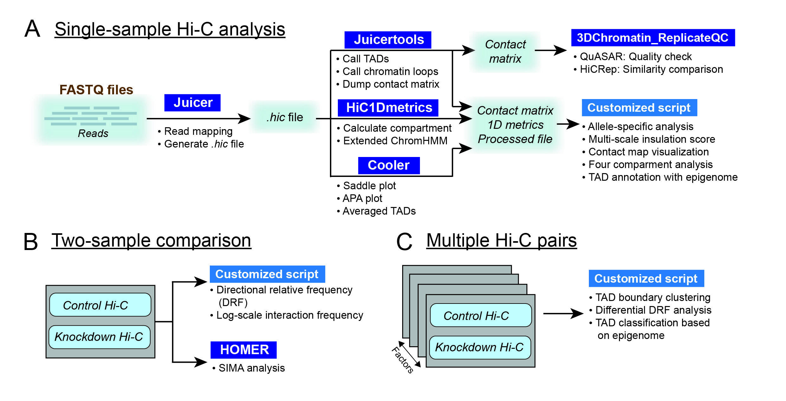

================================================================
CustardPy
================================================================

**CustardPy** is a 3D genome analysis tool written in Python3 and available using the `Docker system <https://www.docker.com/>`_.
It is primarily designed for multi-sample Hi-C analysis (e.g., comparing depletion effects across multiple proteins) and offers various functions for analysis and visualization.
Since the CustardPy docker image includes various existing tools in addition to the core component (see :doc:`./content/Install`),
users can perform a variety of 3D genome analyses without having to install them individually.

A common problem in Hi-C analysis is the strict requirement of specific input formats. Many tools require input data to be in a specific format, and consequently, their use is hindered if the data under investigation does not conform to these specifications.
Since CustardPy covers the processing of Hi-C data from FASTQ and uses the generated data for the subsequent analysis, users can avoid the potential format incompatibility.

.. **Major Release! (version 1)**
   - Unified the Docker images for `CustardPy <https://hub.docker.com/r/rnakato/custardpy>`_ and `CustardPy_Juicer <https://hub.docker.com/r/rnakato/custardpy_juicer>`_. Version 1 of the `CustardPy <https://hub.docker.com/r/rnakato/custardpy>`_ docker image now supports all analyses previously offered by CustardPy and CustardPy_Juicer, rendering the latter unnecessary.

   The workflow of CustardPy for a single sample (A), two samples (B) and multiple sample comparison (C).

Contents:
---------------

.. toctree::
   :numbered:
   :glob:
   :maxdepth: 1

   content/Install
   content/QuickStart
   content/StepbyStep
   content/Visualization
   content/DEGanalysis
   content/Multisample
   content/3DChromatin_ReplicateQC
   content/3dmodel
   content/Command
   content/CustardPy_API

Citation:
--------------

* Nakato R, Sakata T, Wang J, Nagai LAE, Nagaoka Y, Oba GM, Bando M, Shirahige K, Context-dependent perturbations in chromatin folding and the transcriptome by cohesin and related factors, *Nature Communications*, 2023. doi: 10.1038/s41467-023-41316-4
